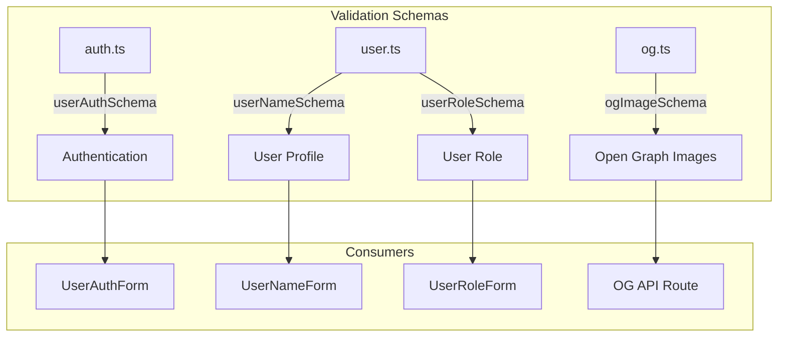
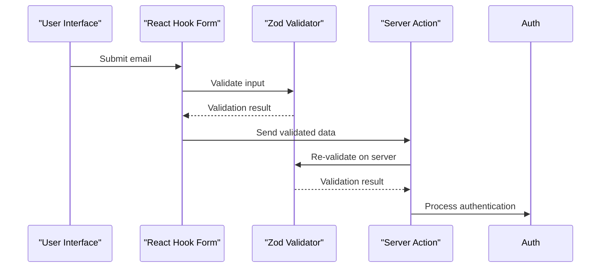
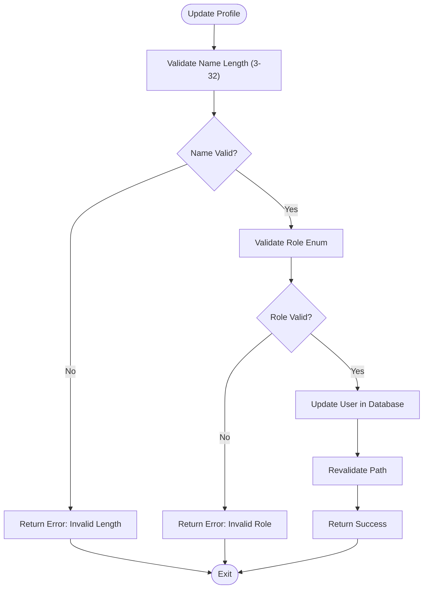
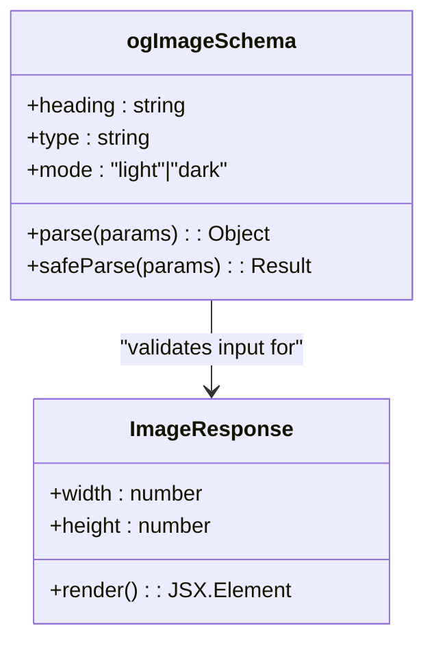
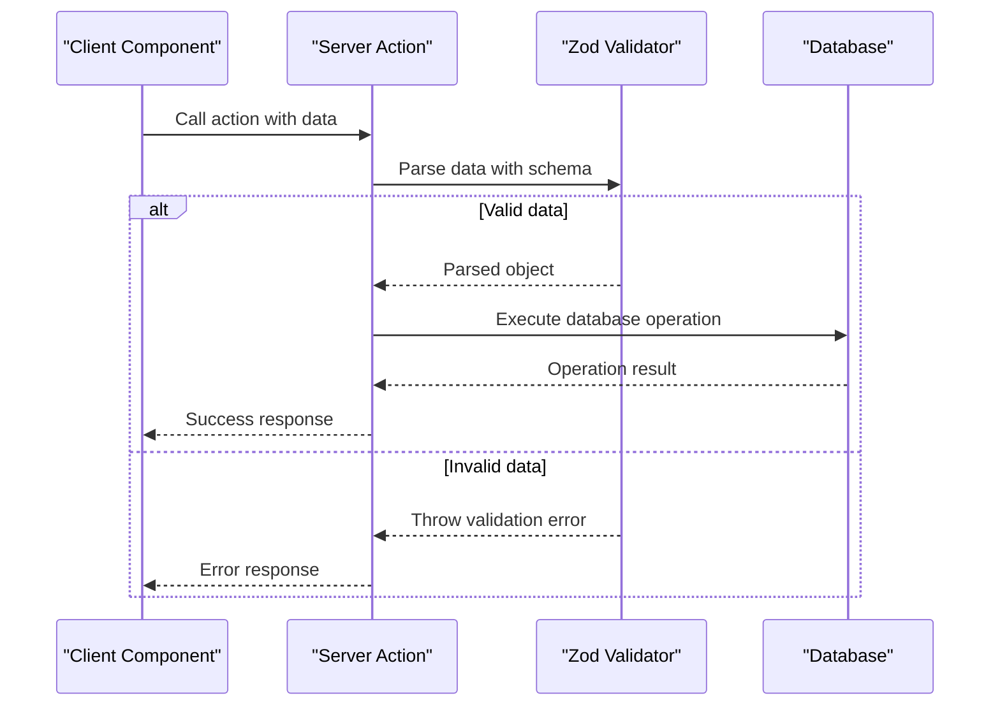
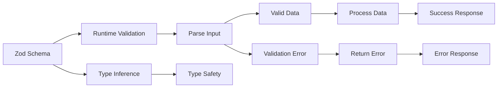
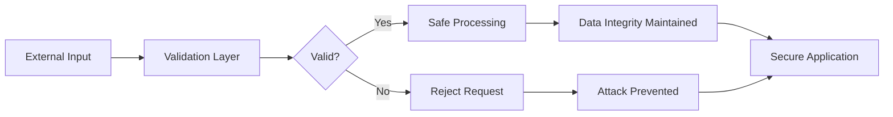
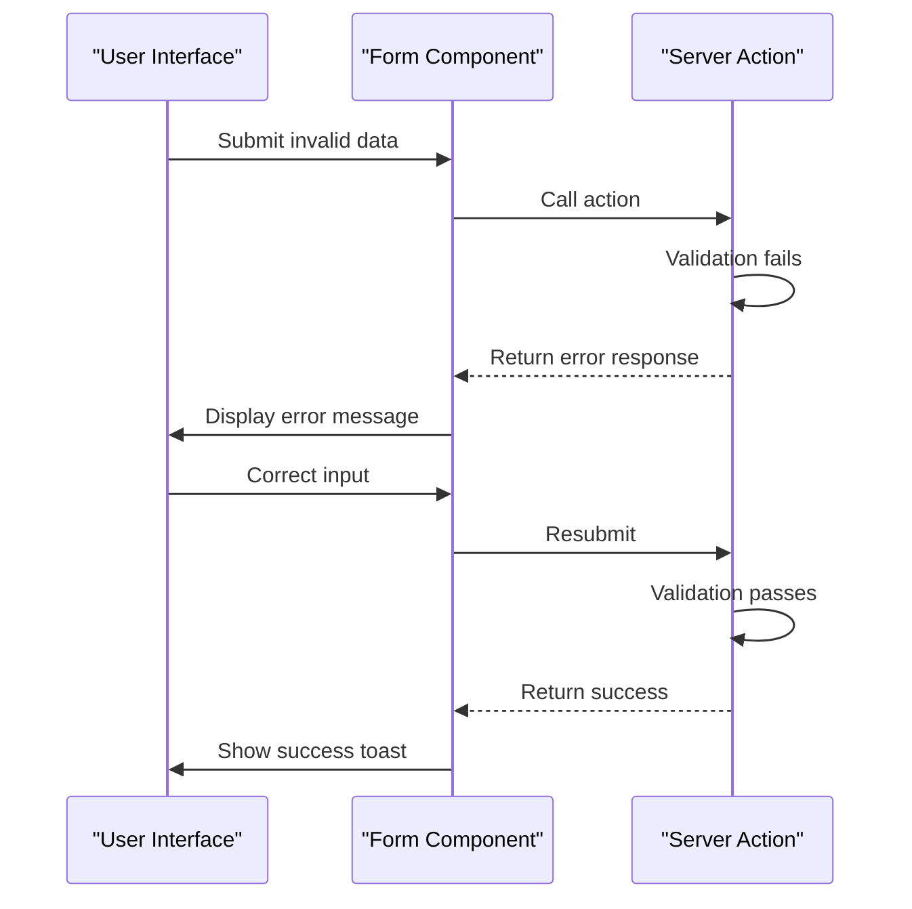

# Data Validation

<cite>
**Referenced Files in This Document**   
- [auth.ts](file://lib/validations/auth.ts)
- [user.ts](file://lib/validations/user.ts)
- [og.ts](file://lib/validations/og.ts)
- [user-auth-form.tsx](file://components/forms/user-auth-form.tsx)
- [user-name-form.tsx](file://components/forms/user-name-form.tsx)
- [user-role-form.tsx](file://components/forms/user-role-form.tsx)
- [route.tsx](file://app/api/og/route.tsx)
- [update-user-name.ts](file://actions/update-user-name.ts)
- [update-user-role.ts](file://actions/update-user-role.ts)
- [QODER_AGENT_RULES.md](file://QODER_AGENT_RULES.md)
</cite>

## Table of Contents
1. [Introduction](#introduction)
2. [Validation Schema Overview](#validation-schema-overview)
3. [Authentication Input Validation](#authentication-input-validation)
4. [User Profile Update Validation](#user-profile-update-validation)
5. [Open Graph Image Generation Validation](#open-graph-image-generation-validation)
6. [Server Actions Integration](#server-actions-integration)
7. [Type Safety and Error Handling](#type-safety-and-error-handling)
8. [Security Implications](#security-implications)
9. [Error Propagation to UI](#error-propagation-to-ui)
10. [Best Practices for Schema Extension](#best-practices-for-schema-extension)

## Introduction
This document details the data validation strategy implemented in the Next.js SaaS Stripe Starter template using Zod schemas. The validation system ensures data integrity, prevents injection attacks, and provides a seamless user experience through consistent error handling. The approach combines compile-time type checking with runtime validation to create a robust defense against malformed or malicious data across authentication, user profile management, and dynamic image generation features.

## Validation Schema Overview

The application implements a centralized validation strategy using Zod schemas located in the `lib/validations/` directory. Each schema corresponds to a specific feature domain and is designed to validate input data before processing. The schemas are used consistently across client components, server actions, and API routes to maintain data integrity throughout the application lifecycle.

**Diagram sources**
- [auth.ts](file://lib/validations/auth.ts#L2-L4)
- [user.ts](file://lib/validations/user.ts#L3-L9)
- [og.ts](file://lib/validations/og.ts#L2-L6)

**Section sources**
- [auth.ts](file://lib/validations/auth.ts#L2-L4)
- [user.ts](file://lib/validations/user.ts#L3-L9)
- [og.ts](file://lib/validations/og.ts#L2-L6)

## Authentication Input Validation

The authentication system implements strict email validation through the `userAuthSchema` defined in `auth.ts`. This schema ensures that only properly formatted email addresses can be submitted for login or registration processes. The validation is applied at both the client and server levels to prevent invalid data from reaching the authentication service.

**Diagram sources**
- [auth.ts](file://lib/validations/auth.ts#L2-L4)
- [user-auth-form.tsx](file://components/forms/user-auth-form.tsx#L21-L21)
- [update-user-name.ts](file://actions/update-user-name.ts#L10-L12)

**Section sources**
- [auth.ts](file://lib/validations/auth.ts#L2-L4)
- [user-auth-form.tsx](file://components/forms/user-auth-form.tsx#L21-L21)

## User Profile Update Validation

User profile updates are protected by two specialized validation schemas: `userNameSchema` and `userRoleSchema`. The name validation enforces a minimum of 3 characters and a maximum of 32 characters, preventing excessively short or long names. The role validation uses `z.nativeEnum(UserRole)` to ensure only predefined role values can be assigned, maintaining data consistency in the user management system.

**Diagram sources**
- [user.ts](file://lib/validations/user.ts#L3-L9)
- [update-user-name.ts](file://actions/update-user-name.ts#L10-L12)
- [update-user-role.ts](file://actions/update-user-role.ts#L10-L12)

**Section sources**
- [user.ts](file://lib/validations/user.ts#L3-L9)
- [user-name-form.tsx](file://components/forms/user-name-form.tsx#L51-L65)
- [user-role-form.tsx](file://components/forms/user-role-form.tsx#L45-L45)

## Open Graph Image Generation Validation

The Open Graph image generation API implements validation through the `ogImageSchema`, which ensures that dynamic image requests contain properly formatted parameters. The schema validates that the heading and type fields are strings, and restricts the mode parameter to either "light" or "dark" with "dark" as the default value. This prevents malformed requests from causing rendering issues in the image generation service.

**Diagram sources**
- [og.ts](file://lib/validations/og.ts#L2-L6)
- [route.tsx](file://app/api/og/route.tsx#L21-L21)

**Section sources**
- [og.ts](file://lib/validations/og.ts#L2-L6)
- [route.tsx](file://app/api/og/route.tsx#L21-L21)

## Server Actions Integration

Validation schemas are tightly integrated with Server Actions to ensure that all data mutations are properly validated before database operations. Each server action imports the relevant schema and uses the `.parse()` method to validate incoming data. This approach follows the security principle of "never trust client input" by re-validating data on the server, even when it has already been validated on the client side.

**Diagram sources**
- [update-user-name.ts](file://actions/update-user-name.ts#L10-L12)
- [update-user-role.ts](file://actions/update-user-role.ts#L10-L12)

**Section sources**
- [update-user-name.ts](file://actions/update-user-name.ts#L10-L12)
- [update-user-role.ts](file://actions/update-user-role.ts#L10-L12)

## Type Safety and Error Handling

The validation strategy leverages Zod's ability to generate TypeScript types from schemas using `z.infer<typeof schema>`. This creates a powerful synergy between compile-time type checking and runtime validation, ensuring that the data structure remains consistent throughout the application. Error handling is implemented through try-catch blocks in server actions, with user-friendly error messages returned to the client for display.

**Diagram sources**
- [auth.ts](file://lib/validations/auth.ts#L2-L4)
- [user.ts](file://lib/validations/user.ts#L3-L9)
- [user-auth-form.tsx](file://components/forms/user-auth-form.tsx#L21-L21)
- [user-name-form.tsx](file://components/forms/user-name-form.tsx#L51-L65)

**Section sources**
- [auth.ts](file://lib/validations/auth.ts#L2-L4)
- [user.ts](file://lib/validations/user.ts#L3-L9)

## Security Implications

The validation system directly addresses security requirements outlined in QODER_AGENT_RULES.md by preventing injection attacks and enforcing data integrity. By validating all user inputs against strict schemas, the application mitigates risks associated with malformed data, parameter tampering, and unauthorized role assignments. The use of enum validation for user roles prevents privilege escalation attacks by ensuring only predefined role values can be assigned.

**Diagram sources**
- [QODER_AGENT_RULES.md](file://QODER_AGENT_RULES.md#L1-L770)
- [user.ts](file://lib/validations/user.ts#L7-L9)

**Section sources**
- [QODER_AGENT_RULES.md](file://QODER_AGENT_RULES.md#L1-L770)
- [user.ts](file://lib/validations/user.ts#L7-L9)

## Error Propagation to UI

Validation errors are propagated from the server to the UI through a consistent error handling pattern. When validation fails, server actions return structured error responses that are interpreted by client components to display appropriate feedback. The form components use React Hook Form with Zod resolver to display field-specific error messages, providing users with clear guidance on how to correct their input.

**Diagram sources**
- [user-auth-form.tsx](file://components/forms/user-auth-form.tsx#L85-L95)
- [user-name-form.tsx](file://components/forms/user-name-form.tsx#L51-L65)
- [user-role-form.tsx](file://components/forms/user-role-form.tsx#L51-L65)

**Section sources**
- [user-auth-form.tsx](file://components/forms/user-auth-form.tsx#L85-L95)
- [user-name-form.tsx](file://components/forms/user-name-form.tsx#L51-L65)

## Best Practices for Schema Extension

When extending validation schemas for new features, follow these best practices:
1. Place new schemas in the appropriate file within `lib/validations/` based on feature domain
2. Use descriptive schema names that clearly indicate their purpose
3. Implement appropriate field constraints (min/max lengths, regex patterns, enum restrictions)
4. Leverage Zod's type inference with `z.infer<typeof schema>` for type safety
5. Always validate data on the server, even when client-side validation exists
6. Return user-friendly error messages that guide users toward correct input
7. Consider performance implications of complex validation rules
8. Document schema requirements and constraints in code comments

These practices ensure that new validation schemas maintain consistency with the existing codebase and adhere to the security and usability standards established in QODER_AGENT_RULES.md.

**Section sources**
- [QODER_AGENT_RULES.md](file://QODER_AGENT_RULES.md#L1-L770)
- [auth.ts](file://lib/validations/auth.ts#L2-L4)
- [user.ts](file://lib/validations/user.ts#L3-L9)
- [og.ts](file://lib/validations/og.ts#L2-L6)