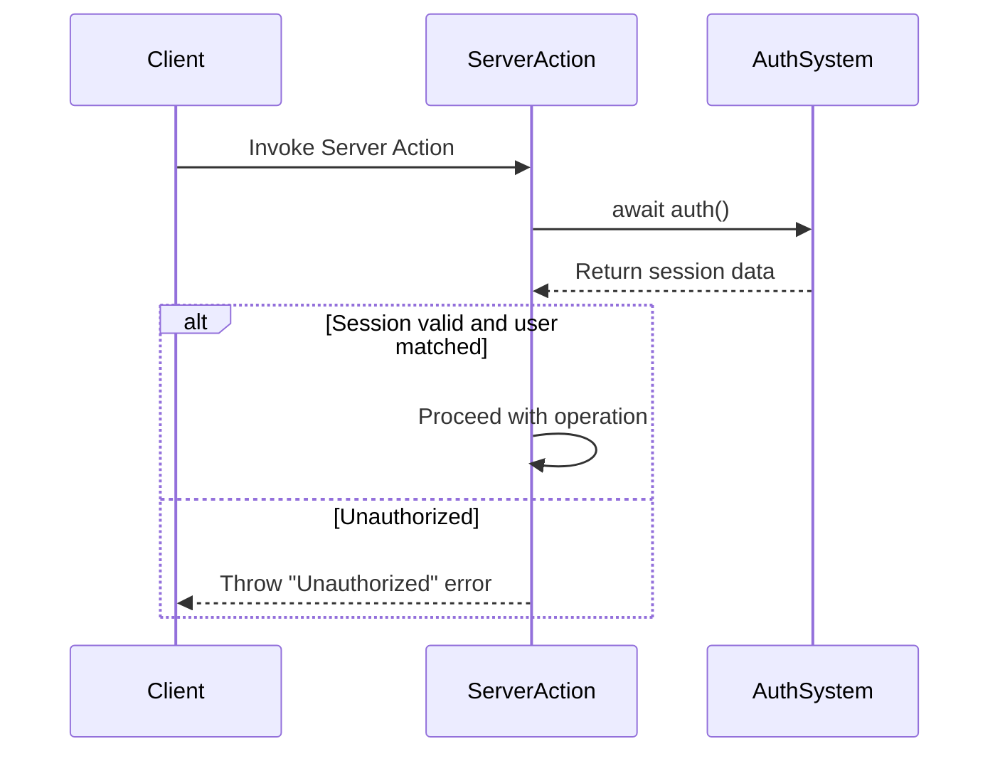
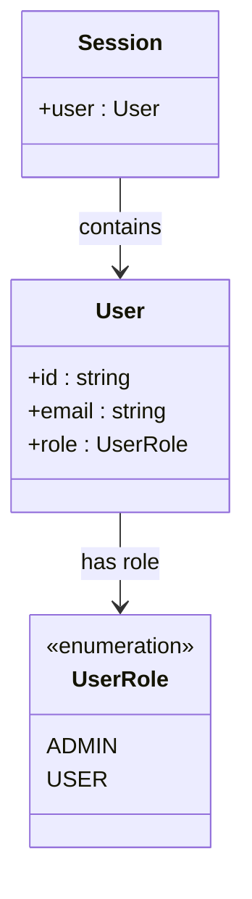
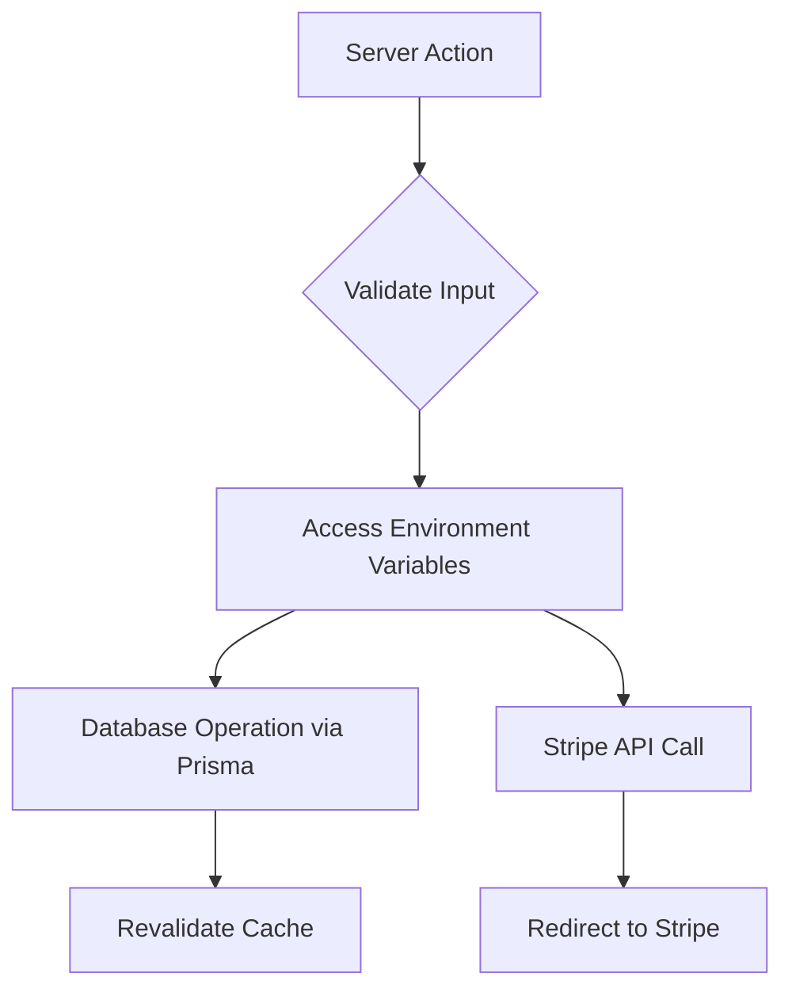
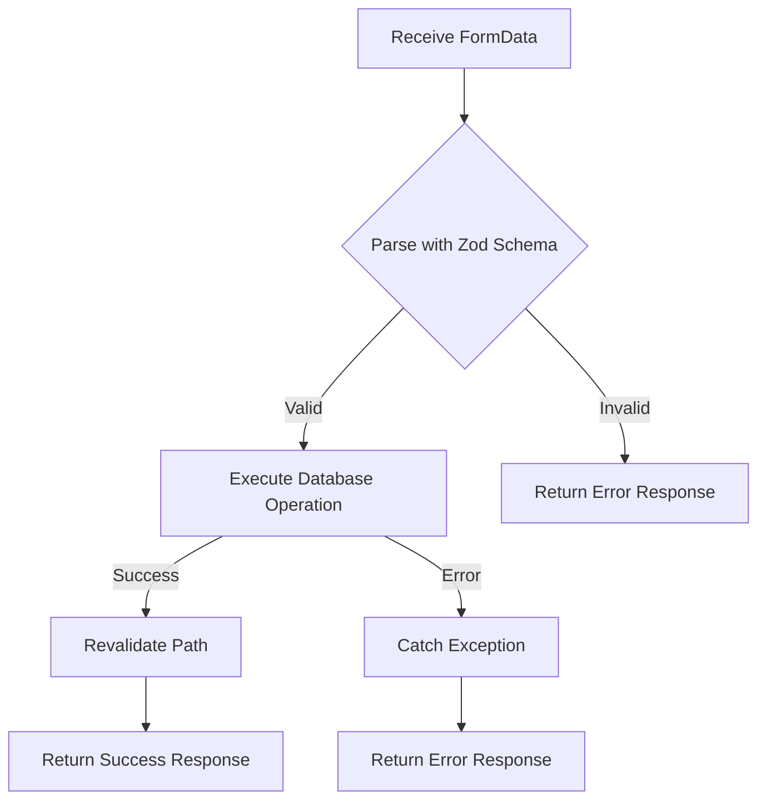

# Secure Server Actions

<cite>
**Referenced Files in This Document**   
- [update-user-name.ts](file://actions/update-user-name.ts)
- [update-user-role.ts](file://actions/update-user-role.ts)
- [generate-user-stripe.ts](file://actions/generate-user-stripe.ts)
- [open-customer-portal.ts](file://actions/open-customer-portal.ts)
- [user.ts](file://lib/validations/user.ts)
- [db.ts](file://lib/db.ts)
- [stripe.ts](file://lib/stripe.ts)
- [auth.ts](file://auth.ts)
- [session.ts](file://lib/session.ts)
- [QODER_AGENT_RULES.md](file://QODER_AGENT_RULES.md)
</cite>

## Table of Contents
1. [Introduction](#introduction)
2. [Authentication and Session Validation](#authentication-and-session-validation)
3. [Authorization Logic and Role Management](#authorization-logic-and-role-management)
4. [Secure Integration with Database and Stripe](#secure-integration-with-database-and-stripe)
5. [Protection Against Unauthorized Access](#protection-against-unauthorized-access)
6. [Server Actions vs Traditional REST APIs](#server-actions-vs-traditional-rest-apis)
7. [Security Considerations](#security-considerations)
8. [Error Handling and Input Validation](#error-handling-and-input-validation)
9. [Compliance with QODER Agent Rules](#compliance-with-qoder-agent-rules)

## Introduction
This document provides a comprehensive analysis of the secure implementation of Server Actions within the Next.js App Router for a SaaS application integrated with Stripe. It details how sensitive operations such as updating user information, managing roles, and handling subscription billing are protected through robust authentication, authorization, and validation mechanisms. The focus is on ensuring that only authenticated and authorized users can perform specific actions, while maintaining secure credential handling and preventing common security vulnerabilities.

## Authentication and Session Validation
Server Actions in this application enforce strict authentication checks by leveraging the centralized `auth` instance from Auth.js v5. Each action begins by retrieving the current session to verify user identity before proceeding with any sensitive operation.

The session validation process follows the pattern outlined in QODER_AGENT_RULES.md, where `await auth()` is used to obtain session data. If the session is missing or the user is not authenticated, an "Unauthorized" error is thrown immediately. This ensures that unauthenticated requests cannot progress further into the system.

For actions requiring user-specific data modification, such as updating a username or role, the action verifies that the authenticated user's ID matches the target user ID. This prevents users from modifying data belonging to other accounts, effectively mitigating impersonation risks.

**Diagram sources**
- [update-user-name.ts](file://actions/update-user-name.ts#L11-L37)
- [auth.ts](file://auth.ts#L0-L67)

**Section sources**
- [update-user-name.ts](file://actions/update-user-name.ts#L11-L37)
- [auth.ts](file://auth.ts#L0-L67)
- [QODER_AGENT_RULES.md](file://QODER_AGENT_RULES.md#L193-L209)

## Authorization Logic and Role Management
The application implements role-based access control (RBAC) using the `UserRole` enum defined in Prisma, which includes `ADMIN` and `USER` roles. While all authenticated users can update their own profile information, administrative privileges are required for certain operations.

The `updateUserRole` Server Action demonstrates this authorization logic by first validating the session and ensuring the user owns the account being modified. However, the current implementation does not explicitly check if the user has administrative privileges before allowing a role change, which could be a potential security concern in production environments.

According to QODER_AGENT_RULES.md, user roles are properly typed using the `UserRole` enum, and session data includes the role information via JWT token augmentation in the NextAuth callbacks. This allows role-based decisions to be made securely on the server side, where client-side tampering is not possible.

**Diagram sources**
- [prisma/schema.prisma](file://prisma/schema.prisma#L15-L18)
- [auth.ts](file://auth.ts#L0-L67)

**Section sources**
- [update-user-role.ts](file://actions/update-user-role.ts#L13-L39)
- [user.ts](file://lib/validations/user.ts#L7-L9)
- [QODER_AGENT_RULES.md](file://QODER_AGENT_RULES.md#L216-L225)

## Secure Integration with Database and Stripe
All Server Actions integrate securely with external services using environment variables and type-safe configurations. The application uses Prisma ORM for database interactions and Stripe's official SDK for payment processing, both configured to run exclusively on the server side.

Database access is handled through the `prisma` client instance exported from `lib/db.ts`, which ensures connection pooling and prevents direct exposure of database credentials. The Stripe client is initialized with the `STRIPE_API_KEY` from environment variables, following the security principle of never exposing secrets to the client side.

Environment variables are managed through `env.mjs`, which uses `@t3-oss/env-nextjs` to provide type-safe validation. Sensitive keys like `STRIPE_API_KEY` and `STRIPE_WEBHOOK_SECRET` are restricted to server-side usage, while only public Stripe price IDs are exposed to the client via `NEXT_PUBLIC_*` variables.

**Diagram sources**
- [db.ts](file://lib/db.ts#L8-L8)
- [stripe.ts](file://lib/stripe.ts#L4-L7)
- [env.mjs](file://env.mjs#L0-L48)

**Section sources**
- [generate-user-stripe.ts](file://actions/generate-user-stripe.ts#L16-L65)
- [db.ts](file://lib/db.ts#L0-L17)
- [stripe.ts](file://lib/stripe.ts#L0-L8)

## Protection Against Unauthorized Access
The application employs multiple layers of protection to prevent unauthorized data manipulation and privilege escalation. Every Server Action performs session validation as the first step, ensuring that only authenticated users can invoke sensitive operations.

For user-specific actions, the system verifies that the session user ID matches the target user ID, preventing cross-user data modification. This ownership check is implemented in both `updateUserName` and `updateUserRole` actions, creating a strong boundary around personal data access.

The use of server-side validation with Zod schemas ensures that input data conforms to expected formats before being processed. For example, `userNameSchema` enforces a minimum length of 3 and maximum of 32 characters for usernames, while `userRoleSchema` restricts role values to the defined `UserRole` enum.

Additionally, the application follows the principle of least privilege by using dedicated service clients (Prisma, Stripe) with scoped permissions, rather than exposing raw database credentials or full-access API keys.

**Section sources**
- [update-user-name.ts](file://actions/update-user-name.ts#L11-L37)
- [update-user-role.ts](file://actions/update-user-role.ts#L13-L39)
- [user.ts](file://lib/validations/user.ts#L3-L9)

## Server Actions vs Traditional REST APIs
The Server Actions pattern significantly reduces the attack surface compared to traditional REST APIs by eliminating the need for dedicated API endpoints. Instead of exposing multiple HTTP routes, all mutations are handled through Next.js Server Actions, which are automatically protected by the framework's server-side execution context.

This approach minimizes the risk of endpoint enumeration and reduces the complexity of authentication middleware. Since Server Actions run exclusively on the server, there is no need to implement CORS policies or CSRF protection for these operations.

The tight integration between Server Actions and React Server Components allows for seamless state updates and automatic cache revalidation using `revalidatePath`. This eliminates the need for manual API client setup and reduces the potential for client-side injection attacks.

Furthermore, the bundling of actions with their consuming components improves code organization and makes it easier to trace security logic from UI to data layer, enhancing maintainability and auditability.

**Section sources**
- [update-user-name.ts](file://actions/update-user-name.ts#L11-L37)
- [QODER_AGENT_RULES.md](file://QODER_AGENT_RULES.md#L247-L291)

## Security Considerations
The application addresses several critical security considerations in its Server Action implementation:

**Replay Attacks**: While not explicitly implemented in the provided code, the use of short-lived sessions and JWT tokens with expiration helps mitigate replay attack risks. The NextAuth configuration should ensure proper token invalidation after logout.

**Rate Limiting**: The current implementation does not include explicit rate limiting, which could make Server Actions vulnerable to brute force attacks. In production, integrating with middleware or external services for rate limiting would be recommended.

**Input Validation**: All Server Actions use Zod schemas for server-side input validation, protecting against malformed data and injection attacks. The schemas are defined in `lib/validations/user.ts` and applied consistently across actions.

**Error Handling**: The actions implement try-catch blocks to handle errors gracefully without exposing sensitive system information. Generic error messages are returned to prevent information leakage, though detailed logging should be implemented in production for debugging purposes.

**Redirect Security**: When redirecting to Stripe, the application uses predefined absolute URLs constructed with `absoluteUrl()` from `lib/utils.ts`, preventing open redirect vulnerabilities.

**Section sources**
- [update-user-name.ts](file://actions/update-user-name.ts#L11-L37)
- [generate-user-stripe.ts](file://actions/generate-user-stripe.ts#L16-L65)
- [user.ts](file://lib/validations/user.ts#L3-L9)

## Error Handling and Input Validation
The application implements robust error handling and input validation to ensure data integrity and provide meaningful feedback to users. Each Server Action wraps its logic in a try-catch block, catching any exceptions that occur during execution.

Input validation is performed using Zod schemas imported from `lib/validations/user.ts`. The `userNameSchema` validates that names are between 3 and 32 characters long, while `userRoleSchema` ensures that role values match the defined `UserRole` enum. This prevents invalid or malicious data from being written to the database.

When validation fails or an error occurs, the actions return a standardized response object with a status field indicating "error". This consistent error handling pattern allows client components to display appropriate user feedback through toast notifications.

The use of `revalidatePath` after successful operations ensures that cached data is updated, providing users with immediate feedback on their changes. However, actions that perform redirects (like Stripe integrations) do not require path revalidation since they navigate away from the current page.

**Diagram sources**
- [update-user-name.ts](file://actions/update-user-name.ts#L11-L37)
- [user.ts](file://lib/validations/user.ts#L3-L5)

**Section sources**
- [update-user-name.ts](file://actions/update-user-name.ts#L11-L37)
- [user.ts](file://lib/validations/user.ts#L3-L9)

## Compliance with QODER Agent Rules
The Server Action implementations strictly adhere to the security guidelines outlined in QODER_AGENT_RULES.md. The application follows the recommended authentication pattern by importing `auth` from "@/auth" and using it to validate sessions in all server-side operations.

The code structure follows the prescribed import order, with dependencies grouped by category (React, Next.js, third-party, environment, utilities, etc.). This consistent structure enhances code readability and maintainability while ensuring that sensitive imports like environment variables are properly isolated.

Security best practices are observed throughout the implementation:
- API keys and secrets are never exposed to client components
- All database mutations occur through Server Actions rather than public API routes
- Environment variables are type-safe and validated at runtime
- Webhook signatures from Stripe are verified using the `STRIPE_WEBHOOK_SECRET`
- User sessions are validated in all protected operations

The application also follows the recommended error handling pattern, using try-catch blocks to handle exceptions gracefully and return user-friendly error messages without exposing system details.

**Section sources**
- [QODER_AGENT_RULES.md](file://QODER_AGENT_RULES.md#L0-L769)
- [update-user-name.ts](file://actions/update-user-name.ts#L11-L37)
- [env.mjs](file://env.mjs#L0-L48)