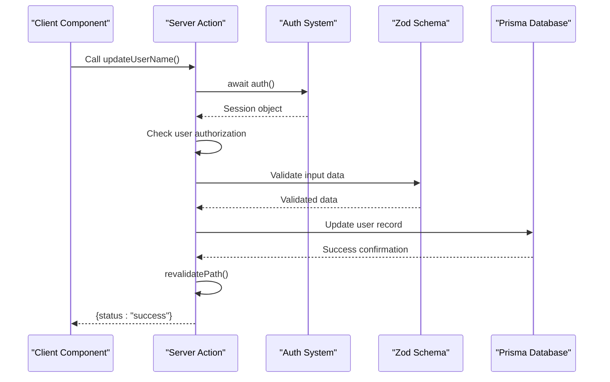
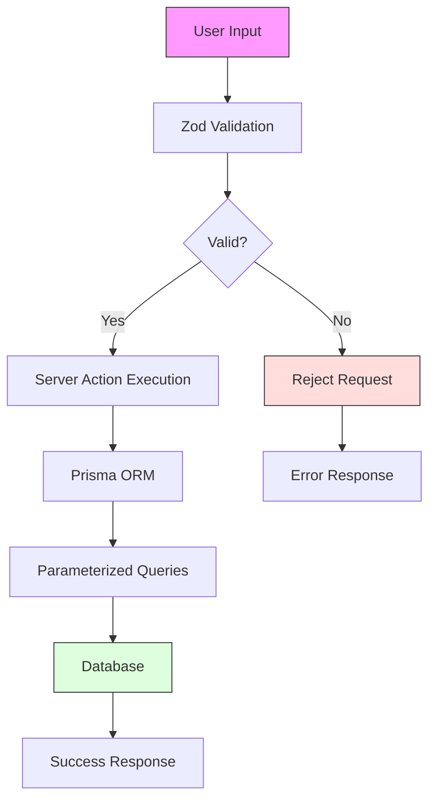

# Security Considerations

<cite>
**Referenced Files in This Document**   
- [auth.config.ts](file://auth.config.ts)
- [auth.ts](file://auth.ts)
- [app/api/auth/[...nextauth]/route.ts](file://app/api/auth/[...nextauth]/route.ts)
- [lib/validations/auth.ts](file://lib/validations/auth.ts)
- [lib/validations/user.ts](file://lib/validations/user.ts)
- [actions/update-user-name.ts](file://actions/update-user-name.ts)
- [actions/update-user-role.ts](file://actions/update-user-role.ts)
- [lib/db.ts](file://lib/db.ts)
- [QODER_AGENT_RULES.md](file://QODER_AGENT_RULES.md)
</cite>

## Table of Contents
1. [Authentication and Session Management](#authentication-and-session-management)
2. [Data Validation with Zod](#data-validation-with-zod)
3. [Secure Server Actions Implementation](#secure-server-actions-implementation)
4. [Protection Against Web Vulnerabilities](#protection-against-web-vulnerabilities)
5. [Sensitive Data Handling](#sensitive-data-handling)
6. [Server Actions vs API Routes Security](#server-actions-vs-api-routes-security)
7. [Secure Deployment Practices](#secure-deployment-practices)

## Authentication and Session Management

The application implements robust authentication through NextAuth.js (Auth.js v5) with multiple provider support including Google OAuth and Resend email magic links. Authentication is centralized through the `auth` instance in `auth.ts`, which ensures consistent security practices across the application. The system uses JWT-based session strategy with secure token handling, where user roles and identifiers are embedded within the JWT token and synchronized with the database via the `jwt` and `session` callbacks.

Session validation occurs on every protected route access, with the middleware automatically enforcing authentication requirements for routes under the `(protected)` directory group. The Prisma adapter ensures secure database integration, while the `auth` helper provides type-safe session access throughout the application. All authentication flows redirect to the configured `/login` page, and unauthorized access attempts are properly handled with clear error responses.

**Section sources**
- [auth.config.ts](file://auth.config.ts#L1-L20)
- [auth.ts](file://auth.ts#L1-L67)
- [app/api/auth/[...nextauth]/route.ts](file://app/api/auth/[...nextauth]/route.ts#L1-L1)

## Data Validation with Zod

The application employs a comprehensive data validation strategy using Zod schemas located in the `lib/validations/` directory. Input validation is performed at multiple layers, ensuring data integrity and security. The `auth.ts` validation schema enforces proper email formatting for authentication flows, while the `user.ts` schema defines strict constraints for user data including name length validation (minimum 3, maximum 32 characters) and role validation against the `UserRole` enum.

These schemas are used consistently across both client-side forms and server-side actions, providing end-to-end type safety. The validation occurs before any database operations, preventing malformed or malicious data from being processed. By using Zod's type inference, the application maintains TypeScript type safety throughout the validation pipeline, reducing the risk of type-related vulnerabilities.

**Section sources**
- [lib/validations/auth.ts](file://lib/validations/auth.ts#L1-L6)
- [lib/validations/user.ts](file://lib/validations/user.ts#L1-L11)

## Secure Server Actions Implementation

Server Actions are implemented with security as a primary concern, following the patterns outlined in QODER_AGENT_RULES.md. Each action begins with authentication verification using the centralized `auth` instance to ensure only authorized users can perform sensitive operations. The `update-user-name.ts` and `update-user-role.ts` actions demonstrate this pattern by first validating the session and ensuring the user has permission to modify their own data.

Input validation is performed using the predefined Zod schemas before any database operations occur. All database mutations use Prisma with proper error handling and transaction safety. After successful operations, the cache is revalidated to ensure data consistency. The actions return standardized response objects that prevent information leakage in error cases, simply indicating "error" status without exposing internal details.

**Diagram sources**
- [actions/update-user-name.ts](file://actions/update-user-name.ts#L1-L38)
- [actions/update-user-role.ts](file://actions/update-user-role.ts#L1-L41)

**Section sources**
- [actions/update-user-name.ts](file://actions/update-user-name.ts#L1-L38)
- [actions/update-user-role.ts](file://actions/update-user-role.ts#L1-L41)

## Protection Against Web Vulnerabilities

The application implements multiple layers of protection against common web vulnerabilities as specified in QODER_AGENT_RULES.md. Cross-Site Scripting (XSS) protection is achieved through Next.js's built-in escaping mechanisms and the use of React's safe rendering practices. The Server Actions pattern inherently provides protection against Cross-Site Request Forgery (CSRF) attacks by leveraging Next.js's server-side execution context and session validation.

SQL injection is mitigated through the use of Prisma ORM, which parameterizes all database queries and prevents direct SQL string construction. The application follows the principle of least privilege in database access, with Prisma ensuring type-safe and schema-constrained operations. All user input is validated before processing, and the use of Zod schemas prevents injection attempts by strictly defining acceptable data formats.

**Diagram sources**
- [lib/validations/auth.ts](file://lib/validations/auth.ts#L1-L6)
- [lib/db.ts](file://lib/db.ts#L1-L17)

## Sensitive Data Handling

The application follows strict protocols for handling sensitive data as outlined in QODER_AGENT_RULES.md. API keys and other secrets are stored in environment variables and accessed through the type-safe `env.mjs` configuration, ensuring they are never exposed to the client-side code. The `server-only` directive in `lib/db.ts` prevents database client access from client components.

Personal information is protected through proper session management, with user identifiers and roles securely stored in JWT tokens. The application uses Prisma's type-safe database access to prevent accidental data exposure, and all user data operations include explicit authorization checks. Sensitive operations like user role updates are restricted to the users themselves, preventing privilege escalation attacks.

**Section sources**
- [auth.config.ts](file://auth.config.ts#L1-L20)
- [lib/db.ts](file://lib/db.ts#L1-L17)
- [QODER_AGENT_RULES.md](file://QODER_AGENT_RULES.md#L1-L770)

## Server Actions vs API Routes Security

The application leverages Server Actions as the preferred pattern over traditional API routes for security-critical operations, following the guidance in QODER_AGENT_RULES.md. Server Actions provide enhanced security by executing directly in the server context without exposing endpoints to the public internet. This eliminates potential attack vectors associated with API route enumeration and reduces the attack surface.

Unlike API routes that require explicit CORS configuration and endpoint protection, Server Actions inherit the application's authentication context automatically. The tight integration with Next.js's caching and revalidation mechanisms ensures data consistency while maintaining security. Error handling in Server Actions is standardized to prevent information leakage, whereas API routes would require additional middleware to achieve the same level of security.

The Server Actions pattern also simplifies authorization logic by allowing direct access to the authentication session without additional token parsing or validation steps. This reduces the complexity that often leads to security vulnerabilities in traditional API implementations.

## Secure Deployment Practices

The application is designed with secure deployment practices in mind, as detailed in QODER_AGENT_RULES.md. The configuration enforces HTTPS in production environments, and security headers are automatically applied through Next.js's built-in protections. The environment variable system ensures that sensitive credentials are never committed to version control.

The deployment checklist in QODER_AGENT_RULES.md outlines critical security steps including switching from test to live Stripe keys, configuring proper OAuth redirect URIs, and verifying webhook endpoint accessibility. The type-safe environment configuration prevents runtime errors due to missing or malformed secrets.

The application follows the principle of least privilege in its dependency management, using pnpm for efficient and secure package installation. The Prisma client is generated at build time, reducing the risk of version mismatches that could lead to security vulnerabilities. The middleware configuration ensures that all protected routes are secured by default, preventing accidental exposure of sensitive functionality.

**Section sources**
- [QODER_AGENT_RULES.md](file://QODER_AGENT_RULES.md#L1-L770)
- [middleware.ts](file://middleware.ts)