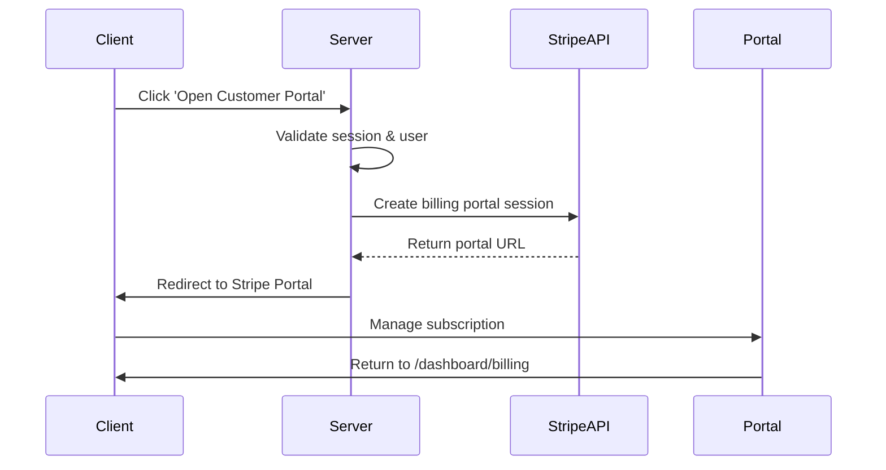
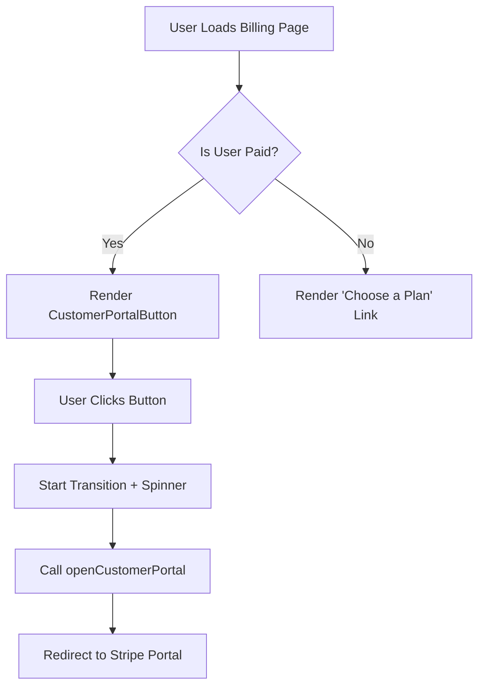
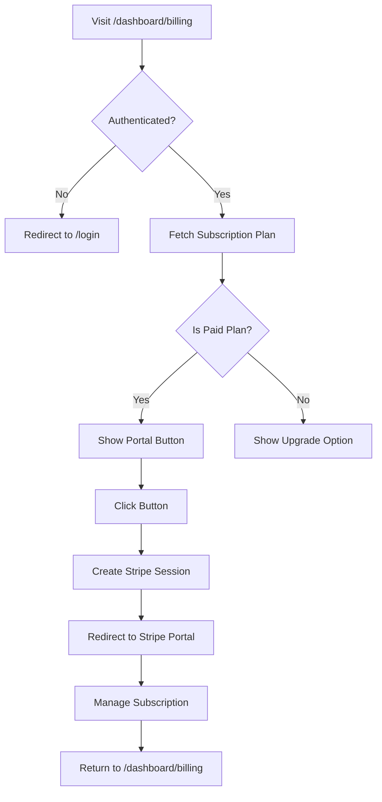
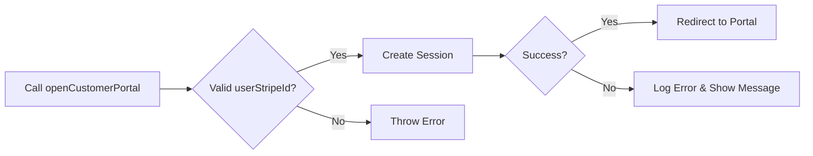

# Customer Portal

<cite>
**Referenced Files in This Document**   
- [open-customer-portal.ts](file://actions/open-customer-portal.ts)
- [customer-portal-button.tsx](file://components/forms/customer-portal-button.tsx)
- [billing-info.tsx](file://components/pricing/billing-info.tsx)
- [stripe.ts](file://lib/stripe.ts)
- [subscription.ts](file://lib/subscription.ts)
- [subscriptions.ts](file://config/subscriptions.ts)
- [index.d.ts](file://types/index.d.ts)
- [page.tsx](file://app/(protected)/dashboard/billing/page.tsx)
</cite>

## Table of Contents
1. [Introduction](#introduction)
2. [Portal Session Creation](#portal-session-creation)
3. [Configuration Options](#configuration-options)
4. [Integration with Customer Portal Button](#integration-with-customer-portal-button)
5. [User Experience Flow](#user-experience-flow)
6. [Security and Error Handling](#security-and-error-handling)
7. [Usage Examples](#usage-examples)
8. [Conclusion](#conclusion)

## Introduction
The Stripe Customer Portal integration enables users to manage their subscription directly through a secure, branded interface provided by Stripe. This document details the implementation of the `open-customer-portal` server action, its configuration, integration with UI components, and the end-to-end user journey. The system ensures only authenticated users can access their billing settings and provides robust error handling for edge cases such as missing Stripe records.

**Section sources**
- [open-customer-portal.ts](file://actions/open-customer-portal.ts#L1-L41)
- [page.tsx](file://app/(protected)/dashboard/billing/page.tsx#L1-L54)

## Portal Session Creation

The `openCustomerPortal` server action is responsible for creating a Stripe Billing Portal session. It accepts a `userStripeId` parameter representing the customer's Stripe ID and uses the Stripe SDK to generate a secure portal URL. Upon successful creation, the user is redirected to Stripe’s hosted portal with a return URL pointing back to the application's billing page at `/dashboard/billing`.

This action runs on the server side using Next.js Server Actions, ensuring sensitive logic and credentials remain secure. It validates the user's authentication state via the `auth()` function before proceeding. If authentication fails or the user lacks an email, the action throws an "Unauthorized" error.

**Diagram sources**
- [open-customer-portal.ts](file://actions/open-customer-portal.ts#L15-L40)
- [stripe.ts](file://lib/stripe.ts#L1-L8)

**Section sources**
- [open-customer-portal.ts](file://actions/open-customer-portal.ts#L15-L40)

## Configuration Options

The Customer Portal is configured with predefined settings including allowed customer operations and branding. These configurations are implicitly managed through Stripe's dashboard rather than hardcoded in the application. However, the integration supports key options:

- **Allowed Operations**: Users can update payment methods and cancel subscriptions based on permissions set in Stripe.
- **Return URL**: Configured dynamically using `absoluteUrl("/dashboard/billing")`, ensuring users return to the correct page after managing their subscription.
- **Branding**: Inherits branding (logo, colors) from Stripe settings linked to the account, ensuring consistency with the application’s identity.

These settings are not defined in code but are part of the Stripe account configuration, which must be aligned with the application's branding and business rules.

**Section sources**
- [open-customer-portal.ts](file://actions/open-customer-portal.ts#L15-L40)
- [subscription.ts](file://lib/subscription.ts#L7-L64)

## Integration with Customer Portal Button

The `CustomerPortalButton` component renders a UI button that triggers the `openCustomerPortal` action. It accepts a `userStripeId` prop and uses React’s `useTransition` hook to handle asynchronous execution with a loading state. When clicked, it initiates the server action via `startTransition`, displaying a spinner during processing.

The button is conditionally rendered in the `BillingInfo` component only when the user has an active paid subscription (`isPaid`) and a valid `stripeCustomerId`. Otherwise, users are prompted to choose a plan.

**Diagram sources**
- [customer-portal-button.tsx](file://components/forms/customer-portal-button.tsx#L1-L30)
- [billing-info.tsx](file://components/pricing/billing-info.tsx#L1-L60)

**Section sources**
- [customer-portal-button.tsx](file://components/forms/customer-portal-button.tsx#L1-L30)
- [billing-info.tsx](file://components/pricing/billing-info.tsx#L1-L60)

## User Experience Flow

The user experience begins when a logged-in user navigates to the `/dashboard/billing` page. The `BillingInfo` component fetches the user's subscription status via `getUserSubscriptionPlan`, which queries both the local database and Stripe API to determine plan details and cancellation status.

If the user is on a paid plan, the "Open Customer Portal" button appears. Clicking it triggers authentication validation, creates a Stripe portal session, and redirects the user to Stripe’s secure interface. After managing their subscription (e.g., updating payment method or canceling), the user is redirected back to the billing page with full context preserved.

This seamless flow ensures users can manage billing without leaving the application ecosystem, enhancing trust and usability.

**Diagram sources**
- [page.tsx](file://app/(protected)/dashboard/billing/page.tsx#L1-L54)
- [subscription.ts](file://lib/subscription.ts#L7-L64)

**Section sources**
- [page.tsx](file://app/(protected)/dashboard/billing/page.tsx#L1-L54)
- [subscription.ts](file://lib/subscription.ts#L7-L64)

## Security and Error Handling

Security is enforced through multiple layers:
- **Authentication Check**: The `openCustomerPortal` action verifies the user session using `auth()` and ensures the user email exists.
- **Authorization**: Only users with a valid Stripe customer ID (`stripeCustomerId`) can access the portal.
- **Server-Side Execution**: Sensitive operations occur on the server, preventing client-side tampering.

Error handling includes:
- Throwing "Unauthorized" if no session exists.
- Catching and re-throwing errors during session creation with a generic message to avoid exposing internal details.
- Graceful fallback in the UI when no Stripe record exists (e.g., showing upgrade options instead of portal access).

Additionally, the system checks for canceled subscriptions via `cancel_at_period_end` in the Stripe subscription object, ensuring accurate status display.

**Section sources**
- [open-customer-portal.ts](file://actions/open-customer-portal.ts#L15-L40)
- [subscription.ts](file://lib/subscription.ts#L7-L64)
- [index.d.ts](file://types/index.d.ts#L61-L67)

## Usage Examples

### Customizing Portal Features
While the portal's appearance and allowed actions are configured in the Stripe Dashboard, developers can control access based on user roles or plan types by conditionally rendering the `CustomerPortalButton`. For example, enterprise users could be granted additional self-service options.

### Handling Session Creation Errors
Developers should ensure proper environment variables are set (e.g., `STRIPE_API_KEY`) and test error scenarios using invalid `userStripeId` values. In production, errors should be logged externally while showing user-friendly messages.

**Diagram sources**
- [open-customer-portal.ts](file://actions/open-customer-portal.ts#L15-L40)

**Section sources**
- [open-customer-portal.ts](file://actions/open-customer-portal.ts#L15-L40)

## Conclusion

The Stripe Customer Portal integration provides a secure, seamless way for users to manage their subscriptions. By leveraging server actions, proper authentication checks, and conditional UI rendering, the system ensures a robust and user-friendly experience. Configuration is managed externally via Stripe, allowing branding and feature access to be updated without code changes. Proper error handling and session management further enhance reliability and security across all usage scenarios.