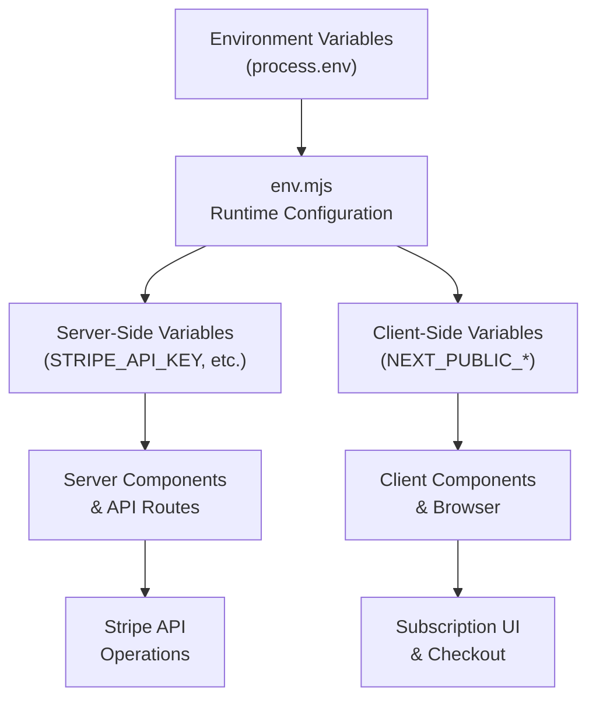
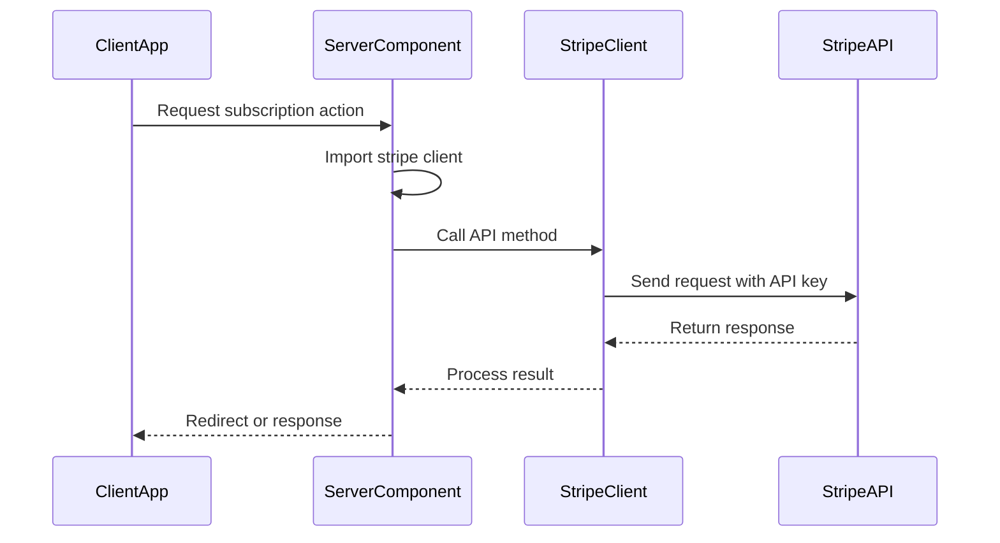
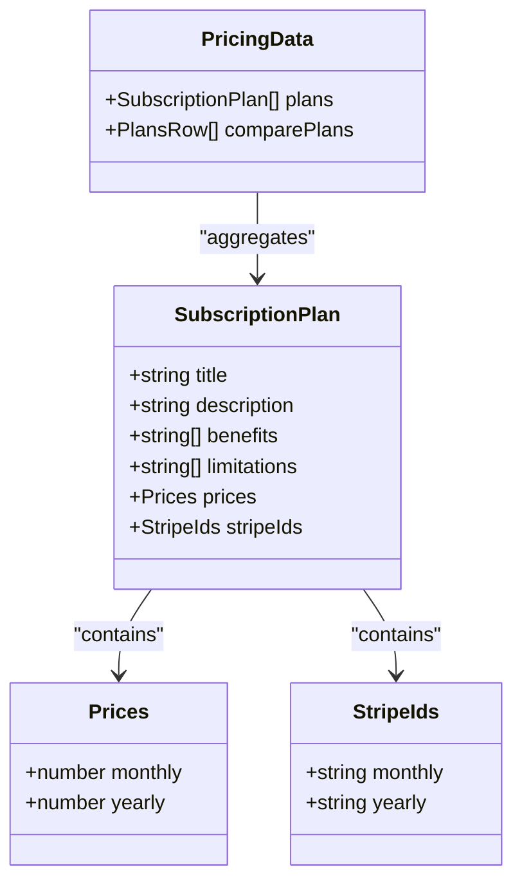

# Environment Configuration

<cite>
**Referenced Files in This Document**   
- [env.mjs](file://env.mjs)
- [lib/stripe.ts](file://lib/stripe.ts)
- [config/subscriptions.ts](file://config/subscriptions.ts)
- [ENVIRONMENT_SETUP_GUIDE.md](file://ENVIRONMENT_SETUP_GUIDE.md)
- [actions/generate-user-stripe.ts](file://actions/generate-user-stripe.ts)
- [app/api/webhooks/stripe/route.ts](file://app/api/webhooks/stripe/route.ts)
</cite>

## Table of Contents
1. [Introduction](#introduction)
2. [Stripe Environment Variables](#stripe-environment-variables)
3. [Environment Loading and Validation](#environment-loading-and-validation)
4. [Stripe Client Initialization](#stripe-client-initialization)
5. [Subscription Plan Configuration](#subscription-plan-configuration)
6. [Stripe Dashboard Setup](#stripe-dashboard-setup)
7. [Development and Production Configuration](#development-and-production-configuration)
8. [Webhook Configuration](#webhook-configuration)
9. [Security Best Practices](#security-best-practices)
10. [Common Configuration Errors](#common-configuration-errors)
11. [Troubleshooting Guide](#troubleshooting-guide)

## Introduction
This document provides comprehensive guidance on configuring the Stripe environment for the Next.js SaaS Stripe Starter application. It covers all required environment variables, their purpose, security requirements, and integration points within the codebase. The configuration enables secure payment processing, subscription management, and webhook handling between the application and Stripe's API.

**Section sources**
- [ENVIRONMENT_SETUP_GUIDE.md](file://ENVIRONMENT_SETUP_GUIDE.md#L0-L223)

## Stripe Environment Variables
The application requires three critical Stripe-related environment variables to function properly. These variables are categorized based on their security level and client accessibility.

### STRIPE_API_KEY
**Purpose**: This server-side secret key authenticates the application with Stripe's API for performing sensitive operations such as creating checkout sessions, managing customer subscriptions, and accessing billing portals.

**Security Requirements**: 
- Must never be exposed to client-side code
- Should use test keys (starting with `sk_test_`) during development
- Must be rotated immediately if compromised
- Requires restricted permissions in production (only necessary API access)

### STRIPE_WEBHOOK_SECRET
**Purpose**: This server-side secret verifies the authenticity of webhook payloads sent from Stripe to the application's webhook endpoint. It prevents unauthorized parties from spoofing Stripe events.

**Security Requirements**:
- Highly sensitive and must remain confidential
- Used to validate signatures in the webhook handler
- Should be rotated periodically as a security measure
- Never transmitted or stored in client-side code

### STRIPE_PUBLIC_KEY
**Purpose**: While not directly named in the environment configuration, the public Stripe keys are exposed through NEXT_PUBLIC environment variables that correspond to specific subscription plans. These enable client-side interactions with Stripe Elements.

**Public Environment Variables**:
- `NEXT_PUBLIC_STRIPE_PRO_MONTHLY_PLAN_ID`: Price ID for Pro plan monthly subscription
- `NEXT_PUBLIC_STRIPE_PRO_YEARLY_PLAN_ID`: Price ID for Pro plan annual subscription  
- `NEXT_PUBLIC_STRIPE_BUSINESS_MONTHLY_PLAN_ID`: Price ID for Business plan monthly subscription
- `NEXT_PUBLIC_STRIPE_BUSINESS_YEARLY_PLAN_ID`: Price ID for Business plan annual subscription

**Security Requirements**:
- Can be safely exposed to client-side code
- Should still be treated with care to prevent misuse
- Changes require corresponding updates in the Stripe dashboard

**Section sources**
- [env.mjs](file://env.mjs#L3-L47)
- [ENVIRONMENT_SETUP_GUIDE.md](file://ENVIRONMENT_SETUP_GUIDE.md#L115-L177)

## Environment Loading and Validation
The application uses a type-safe environment configuration system to load and validate all environment variables at runtime.

### env.mjs Configuration
The `env.mjs` file utilizes `@t3-oss/env-nextjs` with Zod validation to ensure all required environment variables are present and correctly formatted. The configuration separates variables into server and client categories:

- **Server variables**: Accessible only on the server side (STRIPE_API_KEY, STRIPE_WEBHOOK_SECRET)
- **Client variables**: Prefixed with `NEXT_PUBLIC_` and available to client-side code

The `runtimeEnv` object maps environment variable names to their process.env counterparts, providing a single import point (`import { env } from "@/env.mjs"`) throughout the application.

### Type Safety and Validation
All environment variables are validated using Zod schemas:
- String type enforcement
- Minimum length validation (`.min(1)`)
- Optional variables explicitly marked (e.g., NEXTAUTH_URL)
- Immediate application failure if required variables are missing

This approach prevents runtime errors due to misconfigured environments and provides clear error messages during development.



**Diagram sources**
- [env.mjs](file://env.mjs#L3-L47)

**Section sources**
- [env.mjs](file://env.mjs#L3-L47)
- [QODER_AGENT_RULES.md](file://QODER_AGENT_RULES.md#L466-L501)

## Stripe Client Initialization
The Stripe client is initialized in a dedicated module with proper configuration for type safety and API versioning.

### lib/stripe.ts Implementation
The Stripe client is created as a singleton instance in `lib/stripe.ts`:

```typescript
export const stripe = new Stripe(env.STRIPE_API_KEY, {
  apiVersion: "2024-04-10",
  typescript: true,
})
```

**Key Configuration Options**:
- **API Version**: Fixed to `2024-04-10` for consistency and predictability
- **Typescript Support**: Enabled for enhanced type checking in development
- **Environment Integration**: Uses the validated `env.STRIPE_API_KEY` from the configuration system

### Usage Patterns
The initialized `stripe` object is imported throughout the application for various operations:
- Creating checkout sessions for new subscriptions
- Generating billing portal sessions for existing customers
- Handling webhook events from Stripe
- Querying subscription status and customer information

The centralized initialization ensures consistent configuration across all Stripe interactions and simplifies testing and maintenance.



**Diagram sources**
- [lib/stripe.ts](file://lib/stripe.ts#L4-L7)
- [env.mjs](file://env.mjs#L3-L47)

**Section sources**
- [lib/stripe.ts](file://lib/stripe.ts#L4-L7)
- [actions/generate-user-stripe.ts](file://actions/generate-user-stripe.ts#L16-L65)

## Subscription Plan Configuration
Subscription plans are configured in a centralized location with mappings to Stripe price IDs.

### config/subscriptions.ts Structure
The `pricingData` array in `config/subscriptions.ts` defines all available subscription tiers with their features, pricing, and Stripe integration:

```typescript
export const pricingData: SubscriptionPlan[] = [
  {
    title: "Pro",
    description: "Unlock Advanced Features",
    benefits: [...],
    prices: {
      monthly: 15,
      yearly: 144,
    },
    stripeIds: {
      monthly: env.NEXT_PUBLIC_STRIPE_PRO_MONTHLY_PLAN_ID,
      yearly: env.NEXT_PUBLIC_STRIPE_PRO_YEARLY_PLAN_ID,
    },
  },
  // Additional plans...
];
```

### Plan Properties
Each subscription plan includes:
- **title**: Display name for the plan
- **description**: Marketing description
- **benefits**: Array of features included in the plan
- **limitations**: Array of restrictions compared to higher tiers
- **prices**: Monthly and annual pricing in USD
- **stripeIds**: Mapping to Stripe price IDs from environment variables

### Environment Integration
The configuration uses environment variables directly in the `stripeIds` field, creating a secure bridge between the application's UI and Stripe's API. This approach allows for:
- Easy updates to price IDs without code changes
- Consistent type checking through the environment validation system
- Clear separation between pricing logic and Stripe integration

The configuration is used throughout the application to:
- Render pricing tables and feature comparisons
- Generate subscription buttons with correct price IDs
- Determine user entitlements based on active subscriptions



**Diagram sources**
- [config/subscriptions.ts](file://config/subscriptions.ts#L3-L70)
- [env.mjs](file://env.mjs#L3-L47)

**Section sources**
- [config/subscriptions.ts](file://config/subscriptions.ts#L3-L70)
- [components/pricing/pricing-faq.tsx](file://components/pricing/pricing-faq.tsx#L9-L40)

## Stripe Dashboard Setup
Proper configuration of the Stripe dashboard is essential for the application to function correctly.

### API Key Configuration
1. Log in to the [Stripe Dashboard](https://dashboard.stripe.com/)
2. Navigate to **Developers** → **API keys**
3. Copy the **Secret key** (starts with `sk_test_` for test mode)
4. Set `STRIPE_API_KEY=sk_test_your_stripe_secret_key` in your environment

**Important**: Use test keys during development and switch to live keys for production deployment.

### Webhook Endpoint Setup
1. In the Stripe Dashboard, go to **Developers** → **Webhooks**
2. Click **Add endpoint**
3. Set the endpoint URL:
   - Development: `http://localhost:3000/api/webhooks/stripe`
   - Production: `https://yourdomain.com/api/webhooks/stripe`
4. Select the following events to listen for:
   - `customer.subscription.created`
   - `customer.subscription.updated` 
   - `customer.subscription.deleted`
   - `invoice.payment_succeeded`
   - `invoice.payment_failed`
5. Click **Add endpoint**
6. Click on the created webhook endpoint
7. Copy the **Signing secret** (starts with `whsec_`)
8. Set `STRIPE_WEBHOOK_SECRET=whsec_your_webhook_secret` in your environment

### Product and Price Configuration
1. In the Stripe Dashboard, navigate to **Products**
2. Create subscription products for each plan tier:

**Pro Plan Configuration**:
- Click **Add product**
- Name: "Pro Plan"
- Set up pricing: **Recurring** → **Monthly** → $15
- Save the product and copy the **Price ID** (starts with `price_`)
- Set `NEXT_PUBLIC_STRIPE_PRO_MONTHLY_PLAN_ID=price_your_pro_monthly_id`
- Add another price to the same product: **Recurring** → **Yearly** → $144
- Copy the **Price ID** and set `NEXT_PUBLIC_STRIPE_PRO_YEARLY_PLAN_ID=price_your_pro_yearly_id`

**Business Plan Configuration**:
- Repeat the process for the Business tier
- Set `NEXT_PUBLIC_STRIPE_BUSINESS_MONTHLY_PLAN_ID=price_your_business_monthly_id`
- Set `NEXT_PUBLIC_STRIPE_BUSINESS_YEARLY_PLAN_ID=price_your_business_yearly_id`

**Documentation**: [Stripe Products & Pricing](https://stripe.com/docs/products-prices/overview)

**Section sources**
- [ENVIRONMENT_SETUP_GUIDE.md](file://ENVIRONMENT_SETUP_GUIDE.md#L115-L177)
- [app/api/webhooks/stripe/route.ts](file://app/api/webhooks/stripe/route.ts)

## Development and Production Configuration
The application supports different configuration strategies for development and production environments.

### Environment File Management
Create separate environment files for different environments:
- `.env.local` for local development
- `.env.production` for production deployment
- Never commit environment files to version control

### Configuration Differences
| Variable | Development Value | Production Value |
|--------|------------------|------------------|
| STRIPE_API_KEY | `sk_test_...` | `sk_live_...` |
| STRIPE_WEBHOOK_SECRET | `whsec_...` | `whsec_...` (different from dev) |
| NEXT_PUBLIC_APP_URL | `http://localhost:3000` | `https://yourdomain.com` |
| Database_URL | Development database | Production database |

### Deployment Process
1. Generate production-grade secrets for all environment variables
2. Configure the production Stripe account with live API keys
3. Set up webhook endpoints with the production domain
4. Verify all price IDs match the production Stripe products
5. Test the complete subscription flow in production mode

Use environment-specific deployments (e.g., Vercel preview environments) to test configuration changes before applying them to production.

**Section sources**
- [ENVIRONMENT_SETUP_GUIDE.md](file://ENVIRONMENT_SETUP_GUIDE.md#L200-L223)
- [env.mjs](file://env.mjs#L3-L47)

## Webhook Configuration
Webhook handling is critical for maintaining accurate subscription state in the application.

### Webhook Endpoint
The webhook handler is located at `app/api/webhooks/stripe/route.ts` and performs the following functions:
- Receives POST requests from Stripe
- Validates the webhook signature using `STRIPE_WEBHOOK_SECRET`
- Processes various subscription and payment events
- Updates the application's database accordingly

### Event Handling
The application listens for key Stripe events:
- `customer.subscription.created`: When a user subscribes to a plan
- `customer.subscription.updated`: When a subscription is modified
- `customer.subscription.deleted`: When a user cancels their subscription
- `invoice.payment_succeeded`: When a payment is successfully processed
- `invoice.payment_failed`: When a payment attempt fails

### Security Verification
The webhook handler must verify the authenticity of each request using the signing secret:
- Extract the signature from the `Stripe-Signature` header
- Use Stripe's webhook constructEvent method to validate
- Only process events that pass verification
- Reject requests with invalid signatures

This prevents malicious actors from spoofing subscription events and gaining unauthorized access to paid features.

**Section sources**
- [app/api/webhooks/stripe/route.ts](file://app/api/webhooks/stripe/route.ts)
- [ENVIRONMENT_SETUP_GUIDE.md](file://ENVIRONMENT_SETUP_GUIDE.md#L129-L148)

## Security Best Practices
Adhering to security best practices is essential when handling payment information and sensitive credentials.

### Secret Management
- **Never commit secrets**: Ensure `.env.local` and similar files are in `.gitignore`
- **Use strong secrets**: Generate cryptographically secure random values for API keys and secrets
- **Regular rotation**: Periodically rotate API keys and webhook secrets
- **Least privilege**: Use Stripe API keys with the minimum necessary permissions

### Environment Security
- **Validate all inputs**: Use Zod validation for environment variables
- **Separate environments**: Maintain distinct configurations for development, staging, and production
- **Secure storage**: Store production secrets in secure environment variable stores (e.g., Vercel environment variables, AWS Secrets Manager)
- **Access control**: Limit access to environment variables to authorized personnel only

### Application Security
- **Server-side operations**: Perform all sensitive Stripe operations in server components or API routes
- **Input validation**: Validate all user inputs before using them in Stripe API calls
- **Error handling**: Implement proper error handling without exposing sensitive information
- **Monitoring**: Set up monitoring for unusual activity in the Stripe dashboard

Following these practices ensures the security of both the application and its users' payment information.

**Section sources**
- [ENVIRONMENT_SETUP_GUIDE.md](file://ENVIRONMENT_SETUP_GUIDE.md#L210-L223)
- [QODER_AGENT_RULES.md](file://QODER_AGENT_RULES.md#L545-L565)

## Common Configuration Errors
Several common configuration errors can prevent the Stripe integration from working properly.

### Missing Environment Variables
**Symptoms**: Application fails to start or throws "undefined" errors when accessing Stripe functionality.

**Solution**: 
- Verify all required environment variables are present in `.env.local`
- Check for typos in variable names
- Ensure the `.env.local` file is in the correct directory
- Restart the development server after adding variables

### Incorrect Price IDs
**Symptoms**: "No such price" errors when attempting to create a checkout session.

**Solution**:
- Verify the price IDs in the environment variables match exactly with those in the Stripe dashboard
- Check that the price IDs correspond to active products
- Ensure the price IDs are for the correct Stripe account (test vs. live)
- Confirm the price IDs are copied from the correct environment

### Webhook Signature Verification Failures
**Symptoms**: Webhook events are received but fail validation, leading to unprocessed subscription changes.

**Solution**:
- Verify the `STRIPE_WEBHOOK_SECRET` matches exactly with the webhook endpoint's signing secret
- Ensure the webhook endpoint URL is correctly configured in the Stripe dashboard
- Check that the webhook is configured to send the expected events
- Use the Stripe CLI for local webhook testing: `stripe listen --forward-to localhost:3000/api/webhooks/stripe`

### API Key Permissions
**Symptoms**: "Insufficient permissions" errors when calling Stripe API methods.

**Solution**:
- Verify the API key has the necessary permissions in the Stripe dashboard
- Check that the key is not restricted in a way that prevents required operations
- Consider creating a new API key with appropriate permissions
- Ensure you're using the correct key type (secret vs. publishable)

**Section sources**
- [ENVIRONMENT_SETUP_GUIDE.md](file://ENVIRONMENT_SETUP_GUIDE.md#L215-L223)
- [QODER_AGENT_RULES.md](file://QODER_AGENT_RULES.md#L575-L602)

## Troubleshooting Guide
This section provides solutions to common issues encountered during Stripe configuration.

### Development Server Issues
**Problem**: Changes to environment variables are not reflected in the application.
**Solution**: Restart the development server after modifying `.env.local` files, as environment variables are loaded at startup.

### Webhook Testing
**Problem**: Unable to test webhooks locally.
**Solution**: Use the Stripe CLI:
```bash
# Install Stripe CLI
npm install -g stripe-cli

# Authenticate
stripe login

# Forward webhooks to local server
stripe listen --forward-to localhost:3000/api/webhooks/stripe
```

### Subscription Flow Debugging
**Problem**: Users cannot complete the subscription process.
**Solution**:
1. Check browser console for JavaScript errors
2. Verify the price ID is correctly passed to the server action
3. Examine server logs for Stripe API errors
4. Use Stripe test cards to simulate different scenarios:
   - `4242 4242 4242 4242` - Successful payment
   - `4000 0000 0000 9995` - Failed payment
   - `4000 0082 6000 3178` - Requires authentication

### Database Synchronization
**Problem**: User subscription status does not update after webhook events.
**Solution**:
1. Verify the webhook handler is receiving and validating events
2. Check database connection and permissions
3. Ensure the webhook handler has the necessary logic to update user records
4. Examine server logs for database operation errors

### Environment Validation Errors
**Problem**: Application fails to start with Zod validation errors.
**Solution**:
1. Verify all required environment variables are present
2. Check that string variables are not empty
3. Ensure variables are of the correct type (all are strings in this configuration)
4. Consult the `env.mjs` file for the complete list of required variables

**Section sources**
- [ENVIRONMENT_SETUP_GUIDE.md](file://ENVIRONMENT_SETUP_GUIDE.md#L215-L223)
- [actions/generate-user-stripe.ts](file://actions/generate-user-stripe.ts#L16-L65)
- [app/api/webhooks/stripe/route.ts](file://app/api/webhooks/stripe/route.ts)