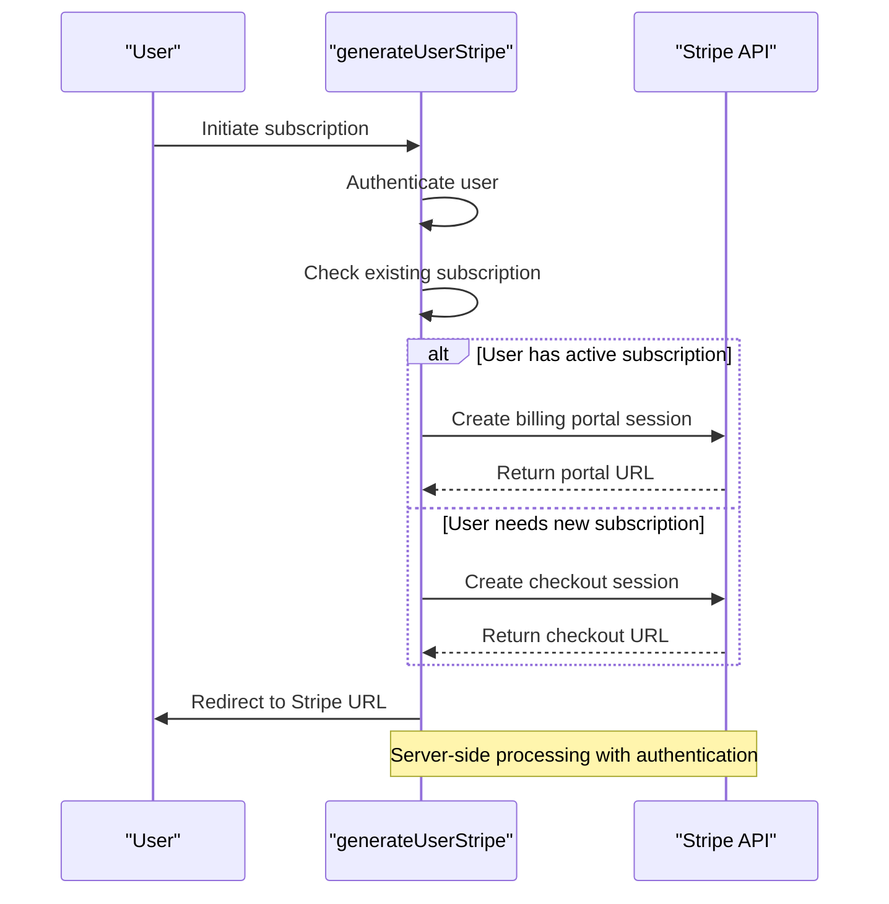
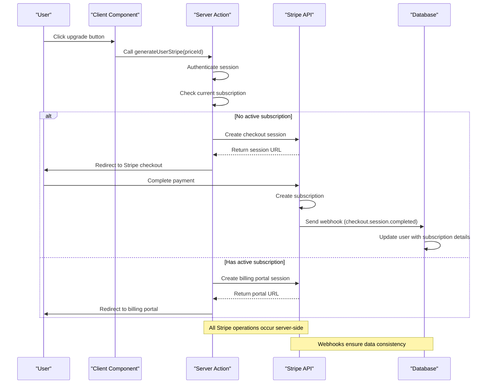
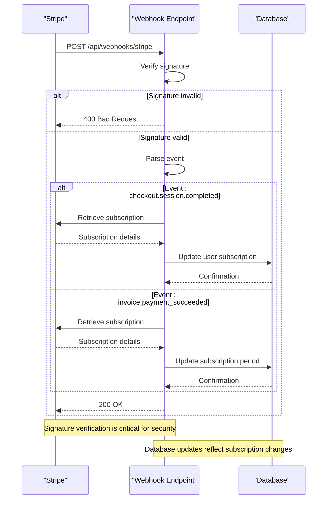

# Stripe Integration

<cite>
**Referenced Files in This Document**   
- [lib/stripe.ts](file://lib/stripe.ts)
- [config/subscriptions.ts](file://config/subscriptions.ts)
- [actions/generate-user-stripe.ts](file://actions/generate-user-stripe.ts)
- [app/api/webhooks/stripe/route.ts](file://app/api/webhooks/stripe/route.ts)
- [actions/open-customer-portal.ts](file://actions/open-customer-portal.ts)
- [components/forms/customer-portal-button.tsx](file://components/forms/customer-portal-button.tsx)
- [lib/subscription.ts](file://lib/subscription.ts)
- [prisma/schema.prisma](file://prisma/schema.prisma)
</cite>

## Table of Contents
1. [Stripe Client Initialization](#stripe-client-initialization)
2. [Subscription Plan Configuration](#subscription-plan-configuration)
3. [Checkout Session Creation](#checkout-session-creation)
4. [Webhook Processing](#webhook-processing)
5. [Customer Portal Implementation](#customer-portal-implementation)
6. [Data Model for Subscription Management](#data-model-for-subscription-management)
7. [Subscription Lifecycle Management](#subscription-lifecycle-management)
8. [Error Handling and Idempotency](#error-handling-and-idempotency)
9. [Sequence Diagrams](#sequence-diagrams)

## Stripe Client Initialization

The Stripe client is initialized in `lib/stripe.ts` using environment variables and the Stripe Node.js SDK. The client is configured with the API key from environment variables and set to use a specific API version for consistency. This centralized initialization ensures that the Stripe client is consistently configured across the application and can be imported wherever needed without reconfiguration.

**Section sources**
- [lib/stripe.ts](file://lib/stripe.ts#L4-L7)

## Subscription Plan Configuration

Subscription plans are configured in `config/subscriptions.ts`, which defines the available pricing tiers including Starter, Pro, and Business plans. Each plan includes details such as title, description, benefits, limitations, and pricing for both monthly and yearly billing cycles. The configuration also maps to Stripe price IDs through environment variables, allowing for easy updates without code changes. The use of environment variables for Stripe price IDs ensures that sensitive identifiers are not hardcoded and can be different between development and production environments.

**Section sources**
- [config/subscriptions.ts](file://config/subscriptions.ts#L3-L70)

## Checkout Session Creation

The checkout session creation process is handled by the `generateUserStripe` server action in `actions/generate-user-stripe.ts`. This function determines whether a user should be directed to the Stripe checkout for a new subscription or to the billing portal for managing an existing subscription. For new subscriptions, it creates a checkout session with the specified price ID, customer email, and metadata including the user ID. For existing paid subscribers, it creates a billing portal session that allows users to manage their subscription. The function handles authentication, verifies user data, and redirects to the appropriate Stripe URL upon successful session creation.

**Diagram sources **
- [actions/generate-user-stripe.ts](file://actions/generate-user-stripe.ts#L16-L65)
- [lib/subscription.ts](file://lib/subscription.ts#L7-L64)

**Section sources**
- [actions/generate-user-stripe.ts](file://actions/generate-user-stripe.ts#L16-L65)

## Webhook Processing

Webhook processing is implemented in `app/api/webhooks/stripe/route.ts` to handle asynchronous events from Stripe. The endpoint verifies the webhook signature using the `STRIPE_WEBHOOK_SECRET` to ensure requests are genuinely from Stripe and not malicious. It processes two key events: `checkout.session.completed` and `invoice.payment_succeeded`. When a checkout session is completed, it updates the user's subscription details in the database, including the subscription ID, customer ID, price ID, and current period end date. For successful invoice payments (excluding initial subscription creation), it updates the price ID and subscription period end date, allowing for plan changes and renewals to be reflected in the application's data store.

**Section sources**
- [app/api/webhooks/stripe/route.ts](file://app/api/webhooks/stripe/route.ts#L1-L77)

## Customer Portal Implementation

The customer portal is implemented through both a server action and a React component. The `openCustomerPortal` server action in `actions/open-customer-portal.ts` creates a billing portal session using the user's Stripe customer ID, allowing them to manage their subscription directly through Stripe's interface. This includes options to update payment methods, change subscription plans, or cancel subscriptions. The `CustomerPortalButton` component in `components/forms/customer-portal-button.tsx` provides a client-side interface that invokes this server action, handling the user interaction and loading states. The implementation uses React's `useTransition` hook to provide a smooth user experience during the asynchronous operation.

**Section sources**
- [actions/open-customer-portal.ts](file://actions/open-customer-portal.ts#L15-L40)
- [components/forms/customer-portal-button.tsx](file://components/forms/customer-portal-button.tsx#L16-L30)

## Data Model for Subscription Management

The data model for subscription management is defined in the Prisma schema at `prisma/schema.prisma`. The User model includes several Stripe-specific fields: `stripeCustomerId`, `stripeSubscriptionId`, `stripePriceId`, and `stripeCurrentPeriodEnd`. These fields are stored with snake_case naming (mapped from camelCase) to follow database conventions. The fields are optional to accommodate users on the free tier, and include unique constraints where appropriate. This data model enables the application to track a user's subscription state, billing information, and current plan details, allowing for accurate determination of subscription status and access to premium features.

**Section sources**
- [prisma/schema.prisma](file://prisma/schema.prisma#L50-L65)

## Subscription Lifecycle Management

The subscription lifecycle is managed through a combination of client-side interactions, server actions, and webhook handlers. When a user signs up for a paid plan, they enter a trial period (if configured in Stripe) before their first payment is processed. The webhook handler captures the `checkout.session.completed` event to update the user's subscription status in the database. Subsequent renewals are handled by the `invoice.payment_succeeded` event, which updates the subscription period end date. Users can upgrade, downgrade, or cancel their subscriptions through the customer portal, with changes reflected in the database via webhook events. The `getUserSubscriptionPlan` function in `lib/subscription.ts` determines the current subscription status by checking the price ID and period end date, also retrieving cancellation status directly from Stripe to provide accurate information about upcoming subscription changes.

**Section sources**
- [lib/subscription.ts](file://lib/subscription.ts#L7-L64)
- [app/api/webhooks/stripe/route.ts](file://app/api/webhooks/stripe/route.ts#L1-L77)

## Error Handling and Idempotency

Error handling in the Stripe integration follows a consistent pattern across server actions. Each function uses try-catch blocks to handle potential errors during Stripe API calls, throwing descriptive error messages when operations fail. Authentication is verified at the beginning of each server action, ensuring only authorized users can initiate subscription-related operations. The webhook endpoint includes specific error handling for signature verification, returning appropriate HTTP status codes to indicate validation failures. Idempotency is inherently handled by Stripe's API, which supports idempotent requests through the use of idempotency keys, though this implementation relies on Stripe's default behavior rather than explicitly setting these keys. The use of server actions for all Stripe operations ensures that sensitive API keys remain server-side and are never exposed to the client.

**Section sources**
- [actions/generate-user-stripe.ts](file://actions/generate-user-stripe.ts#L16-L65)
- [actions/open-customer-portal.ts](file://actions/open-customer-portal.ts#L15-L40)
- [app/api/webhooks/stripe/route.ts](file://app/api/webhooks/stripe/route.ts#L1-L77)

## Sequence Diagrams

### Subscription Creation Flow

**Diagram sources **
- [actions/generate-user-stripe.ts](file://actions/generate-user-stripe.ts#L16-L65)
- [app/api/webhooks/stripe/route.ts](file://app/api/webhooks/stripe/route.ts#L1-L77)

### Webhook Processing Flow

**Diagram sources **
- [app/api/webhooks/stripe/route.ts](file://app/api/webhooks/stripe/route.ts#L1-L77)
- [prisma/schema.prisma](file://prisma/schema.prisma#L50-L65)