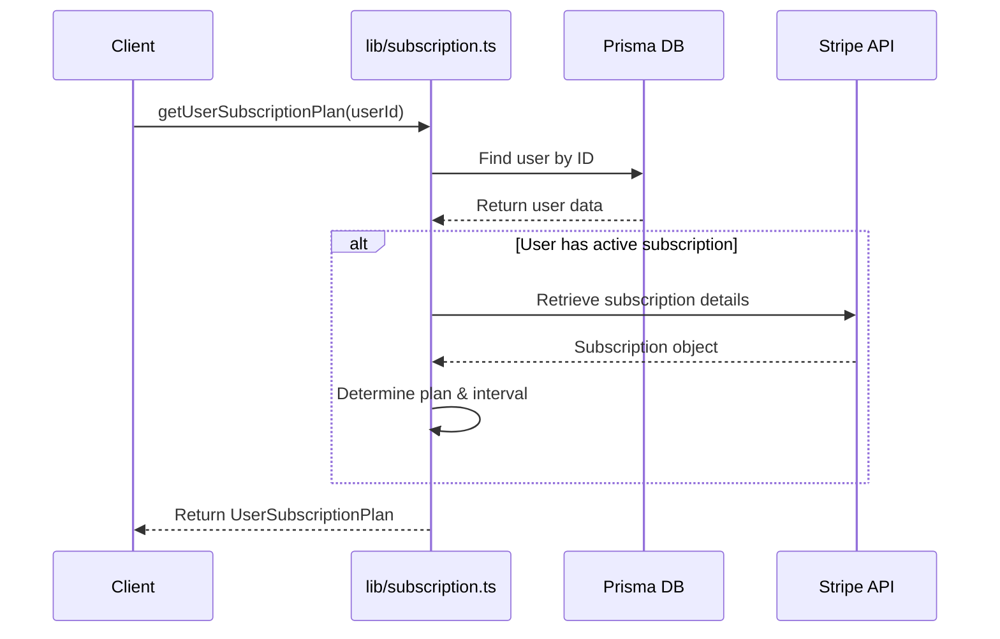
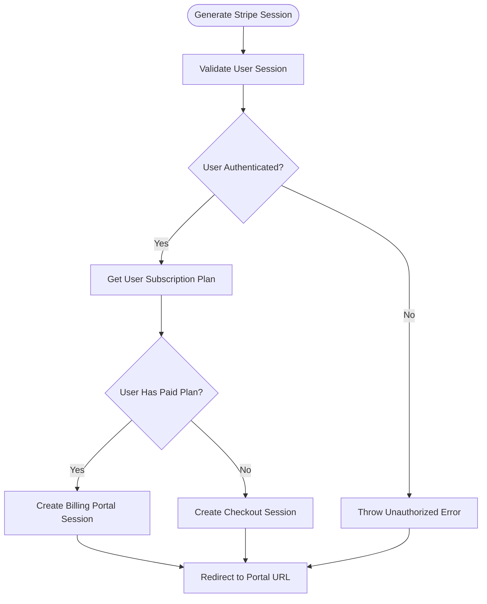
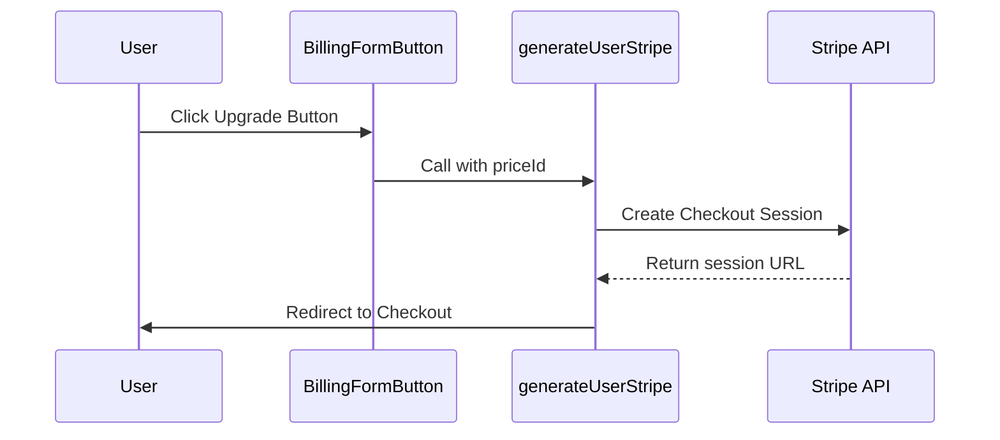
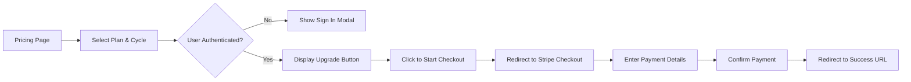
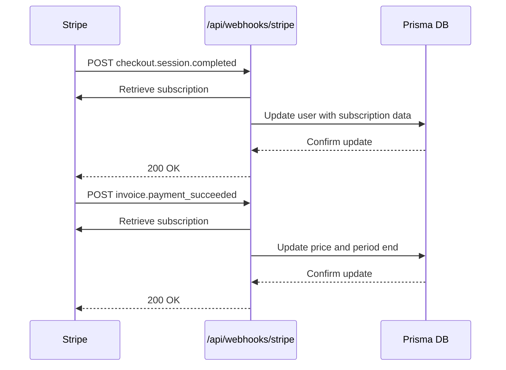
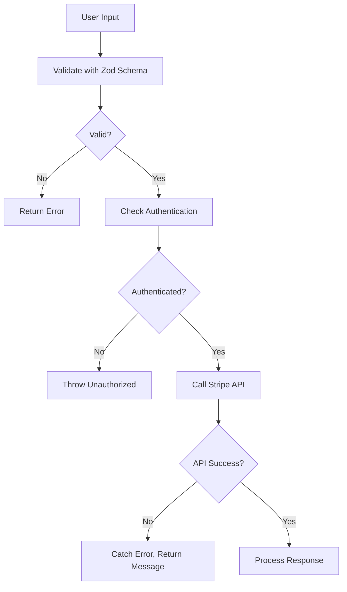

# Subscription Flow

<cite>
**Referenced Files in This Document**   
- [config/subscriptions.ts](file://config/subscriptions.ts)
- [lib/subscription.ts](file://lib/subscription.ts)
- [actions/generate-user-stripe.ts](file://actions/generate-user-stripe.ts)
- [components/forms/billing-form-button.tsx](file://components/forms/billing-form-button.tsx)
- [app/(marketing)/pricing/page.tsx](file://app/(marketing)/pricing/page.tsx)
- [components/pricing/pricing-cards.tsx](file://components/pricing/pricing-cards.tsx)
- [app/api/webhooks/stripe/route.ts](file://app/api/webhooks/stripe/route.ts)
- [lib/validations/user.ts](file://lib/validations/user.ts)
- [lib/stripe.ts](file://lib/stripe.ts)
- [types/index.d.ts](file://types/index.d.ts)
</cite>

## Table of Contents
1. [Introduction](#introduction)
2. [Subscription Plan Configuration](#subscription-plan-configuration)
3. [Retrieving Subscription Plans](#retrieving-subscription-plans)
4. [Stripe Checkout Session Creation](#stripe-checkout-session-creation)
5. [Client-Side Integration with Billing Form](#client-side-integration-with-billing-form)
6. [User Journey from Plan Selection to Confirmation](#user-journey-from-plan-selection-to-confirmation)
7. [Handling Checkout Outcomes](#handling-checkout-outcomes)
8. [Post-Checkout Redirect and Webhook Processing](#post-checkout-redirect-and-webhook-processing)
9. [Customization of Plan Options and Trial Periods](#customization-of-plan-options-and-trial-periods)
10. [Idempotency, Error Handling, and Security Considerations](#idempotency-error-handling-and-security-considerations)

## Introduction
This document details the implementation of the subscription flow in the SaaS application, focusing on how users select and upgrade to paid plans using Stripe. The system integrates frontend components for plan display and selection with server-side logic for secure Stripe session generation and webhook handling. It covers the full lifecycle from plan definition to payment confirmation, including error handling, security validation, and post-purchase state updates.

## Subscription Plan Configuration
Subscription plans are defined in `config/subscriptions.ts`, where each plan includes metadata such as title, description, pricing, benefits, limitations, and associated Stripe price IDs. These configurations are used both for UI rendering and backend processing during checkout.

The `pricingData` array contains three tiers: Starter (free), Pro, and Business. Each includes monthly and yearly pricing, with corresponding Stripe price IDs pulled from environment variables. This structure enables dynamic rendering of plan features and pricing while ensuring secure reference to actual Stripe products.

```mermaid
classDiagram
class SubscriptionPlan {
+string title
+string description
+string[] benefits
+string[] limitations
+prices : { monthly : number, yearly : number }
+stripeIds : { monthly : string | null, yearly : string | null }
}
```

**Diagram sources**
- [config/subscriptions.ts](file://config/subscriptions.ts#L4-L163)
- [types/index.d.ts](file://types/index.d.ts#L68-L78)

**Section sources**
- [config/subscriptions.ts](file://config/subscriptions.ts#L4-L163)

## Retrieving Subscription Plans
The `getUserSubscriptionPlan` function in `lib/subscription.ts` retrieves the current subscription status of a user by querying the database and matching the Stripe price ID against the configured plans. It determines whether the user is on a paid plan, the billing interval, and cancellation status.

This function returns a `UserSubscriptionPlan` object that merges plan configuration with user-specific subscription data, enabling consistent access to plan details across the application.



**Diagram sources**
- [lib/subscription.ts](file://lib/subscription.ts#L9-L65)
- [types/index.d.ts](file://types/index.d.ts#L79-L88)

**Section sources**
- [lib/subscription.ts](file://lib/subscription.ts#L9-L65)

## Stripe Checkout Session Creation
The `generateUserStripe` action in `actions/generate-user-stripe.ts` handles the creation of Stripe Checkout sessions. It first checks the user's authentication status and existing subscription. If the user is already on a paid plan, it redirects them to the Stripe Customer Portal for management. Otherwise, it creates a new Checkout session for subscription upgrade.

The session is configured with success and cancel URLs, payment method types, billing address collection, and line items based on the selected price ID. User identification is securely maintained via metadata containing the user ID.



**Diagram sources**
- [actions/generate-user-stripe.ts](file://actions/generate-user-stripe.ts#L1-L65)
- [lib/stripe.ts](file://lib/stripe.ts#L1-L8)

**Section sources**
- [actions/generate-user-stripe.ts](file://actions/generate-user-stripe.ts#L1-L65)

## Client-Side Integration with Billing Form
The `BillingFormButton` component in `components/forms/billing-form-button.tsx` provides the UI for initiating the subscription process. It conditionally displays "Upgrade" or "Manage Subscription" based on the user's current plan and the selected offer.

When clicked, it triggers the `generateUserStripe` action with the appropriate price ID (monthly or yearly), using React's `useTransition` for loading state management. The button is disabled during processing to prevent duplicate submissions.



**Diagram sources**
- [components/forms/billing-form-button.tsx](file://components/forms/billing-form-button.tsx#L1-L51)
- [actions/generate-user-stripe.ts](file://actions/generate-user-stripe.ts#L1-L65)

**Section sources**
- [components/forms/billing-form-button.tsx](file://components/forms/billing-form-button.tsx#L1-L51)

## User Journey from Plan Selection to Confirmation
The user journey begins on the pricing page (`app/(marketing)/pricing/page.tsx`), where available plans are rendered using `PricingCards`. Users select a plan and billing cycle (monthly/yearly) via a toggle interface.

Upon selecting a plan, authenticated users see either a "Manage Subscription" button (if already on that plan) or an "Upgrade" button. Clicking initiates the Stripe Checkout flow, redirecting to Stripe's secure payment page where users enter payment details.

After successful payment, Stripe redirects back to the application's billing URL, completing the subscription setup.



**Diagram sources**
- [app/(marketing)/pricing/page.tsx](file://app/(marketing)/pricing/page.tsx#L1-L57)
- [components/pricing/pricing-cards.tsx](file://components/pricing/pricing-cards.tsx#L1-L193)

**Section sources**
- [app/(marketing)/pricing/page.tsx](file://app/(marketing)/pricing/page.tsx#L1-L57)
- [components/pricing/pricing-cards.tsx](file://components/pricing/pricing-cards.tsx#L1-L193)

## Handling Checkout Outcomes
The application handles both successful and failed checkout attempts through Stripe's built-in redirect mechanism. The `success_url` and `cancel_url` are both set to the billing page, providing a consistent return point.

While the current implementation does not display specific success or error messages upon return, the system relies on webhook processing to update the user's subscription status in the database. Future enhancements could include query parameter-based feedback from Stripe to inform users of the outcome.

## Post-Checkout Redirect and Webhook Processing
After a successful checkout, Stripe calls the webhook endpoint at `app/api/webhooks/stripe/route.ts` to notify the application of the `checkout.session.completed` event. This triggers the update of the user's record in the database with Stripe customer and subscription IDs, price ID, and current period end date.

The webhook also handles `invoice.payment_succeeded` events for subscription renewals or upgrades, updating the price ID and period end date accordingly.



**Diagram sources**
- [app/api/webhooks/stripe/route.ts](file://app/api/webhooks/stripe/route.ts#L1-L77)

**Section sources**
- [app/api/webhooks/stripe/route.ts](file://app/api/webhooks/stripe/route.ts#L1-L77)

## Customization of Plan Options and Trial Periods
Plan options are customized through the `pricingData` configuration in `config/subscriptions.ts`. Developers can modify benefits, pricing, and Stripe IDs to reflect different offerings. The UI automatically reflects these changes through the `PricingCards` component.

While the current implementation does not include trial periods, they could be added by configuring Stripe prices with trial durations or by extending the `generateUserStripe` function to include a `trial_period_days` parameter in the Checkout session creation.

## Idempotency, Error Handling, and Security Considerations
The subscription flow incorporates several security and reliability measures:

- **Input Validation**: User input is validated using Zod schemas from `lib/validations/user.ts`, ensuring data integrity before processing.
- **Authentication Checks**: The `generateUserStripe` action verifies user authentication and session validity before proceeding.
- **Error Handling**: Errors during Stripe API calls are caught and result in descriptive messages, preventing unhandled exceptions.
- **Idempotency**: While not explicitly implemented, Stripe Checkout sessions are idempotent by nature when using the same client reference ID (not currently used).
- **Secure Metadata**: User identification is passed via Checkout session metadata, preventing direct manipulation of user IDs in client-facing parameters.



**Diagram sources**
- [lib/validations/user.ts](file://lib/validations/user.ts#L1-L10)
- [actions/generate-user-stripe.ts](file://actions/generate-user-stripe.ts#L1-L65)

**Section sources**
- [lib/validations/user.ts](file://lib/validations/user.ts#L1-L10)
- [actions/generate-user-stripe.ts](file://actions/generate-user-stripe.ts#L1-L65)