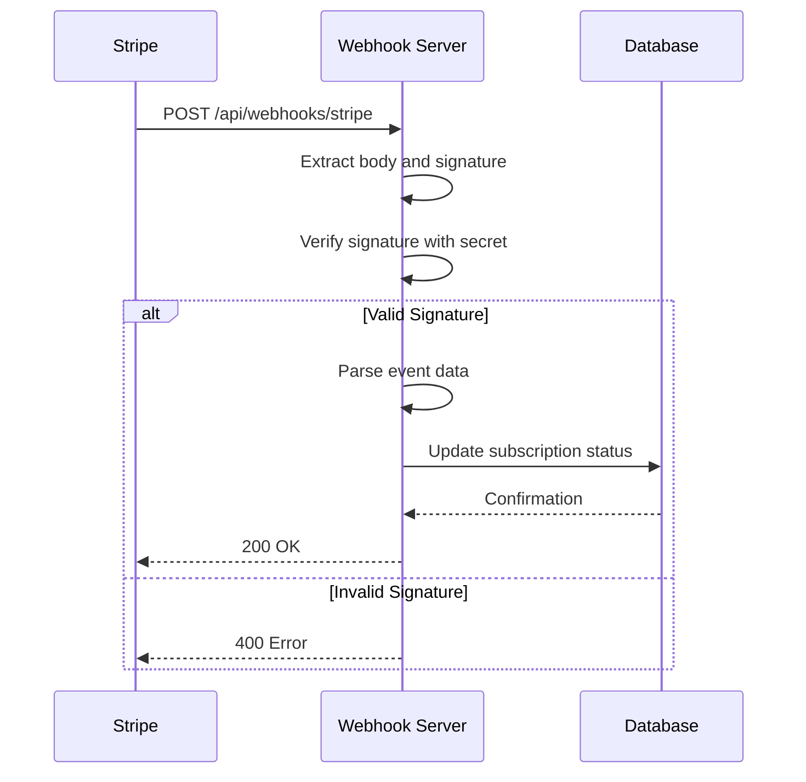
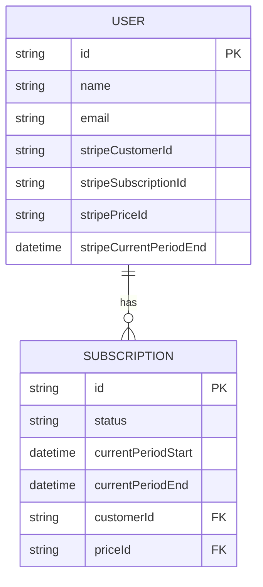

# Webhook Processing

<cite>
**Referenced Files in This Document**   
- [route.ts](file://app/api/webhooks/stripe/route.ts)
- [env.mjs](file://env.mjs)
- [db.ts](file://lib/db.ts)
- [stripe.ts](file://lib/stripe.ts)
- [subscription.ts](file://lib/subscription.ts)
- [migration.sql](file://prisma/migrations/0_init/migration.sql)
- [ENVIRONMENT_SETUP_GUIDE.md](file://ENVIRONMENT_SETUP_GUIDE.md)
</cite>

## Table of Contents
1. [Introduction](#introduction)
2. [Webhook Endpoint Overview](#webhook-endpoint-overview)
3. [Security and Authentication](#security-and-authentication)
4. [Event Handling and Database Updates](#event-handling-and-database-updates)
5. [Idempotency Implementation](#idempotency-implementation)
6. [Webhook Payload Examples](#webhook-payload-examples)
7. [Local Testing with Stripe CLI](#local-testing-with-stripe-cli)
8. [Environment Variables](#environment-variables)
9. [Troubleshooting Common Issues](#troubleshooting-common-issues)
10. [Appendices](#appendices)

## Introduction
This document provides comprehensive documentation for the Stripe webhook endpoint in the Next.js SaaS Stripe Starter application. It details the implementation of secure webhook processing, event handling, database synchronization, and best practices for testing and debugging. The webhook system enables the application to respond to subscription lifecycle events from Stripe and maintain accurate user subscription status in the database.

## Webhook Endpoint Overview

The Stripe webhook endpoint is implemented as a Next.js API route at `/api/webhooks/stripe` and handles incoming HTTP POST requests from Stripe. The endpoint processes subscription-related events and updates the user's subscription status in the database via Prisma ORM.

The webhook supports the following event types:
- `checkout.session.completed`: Triggered when a customer completes the checkout process
- `invoice.payment_succeeded`: Triggered when an invoice payment succeeds, including subscription updates
- `customer.subscription.created`: Triggered when a new subscription is created
- `customer.subscription.updated`: Triggered when a subscription is updated
- `customer.subscription.deleted`: Triggered when a subscription is canceled

The endpoint is designed to be publicly accessible but secured through Stripe's signature verification mechanism. It must be exposed at the following URLs:
- Development: `http://localhost:3000/api/webhooks/stripe`
- Production: `https://yourdomain.com/api/webhooks/stripe`

```mermaid
flowchart TD
A[Stripe Webhook Event] --> B{HTTP POST Request}
B --> C[/api/webhooks/stripe]
C --> D[Extract Request Body and Signature]
D --> E[Verify Signature with Secret]
E --> F{Valid Signature?}
F --> |Yes| G[Parse Event Type]
F --> |No| H[Return 400 Error]
G --> I{Event Type}
I --> |checkout.session.completed| J[Update User Subscription]
I --> |invoice.payment_succeeded| K[Update Subscription Details]
J --> L[Return 200 OK]
K --> L
H --> L
```

**Diagram sources**
- [route.ts](file://app/api/webhooks/stripe/route.ts#L1-L77)

**Section sources**
- [route.ts](file://app/api/webhooks/stripe/route.ts#L1-L77)

## Security and Authentication

The webhook endpoint implements Stripe's signature verification to authenticate incoming events and prevent unauthorized access. This security mechanism ensures that only legitimate requests from Stripe are processed.

The verification process follows these steps:
1. Extract the request body as text
2. Retrieve the Stripe signature from the `Stripe-Signature` header
3. Use Stripe's `constructEvent` method to verify the signature against the webhook secret
4. If verification fails, return a 400 Bad Request response

The webhook secret is stored in the environment variable `STRIPE_WEBHOOK_SECRET` and is never exposed to the client-side code. This secret must be configured in the `.env` file and matches the signing secret provided by Stripe when creating the webhook endpoint.



**Diagram sources**
- [route.ts](file://app/api/webhooks/stripe/route.ts#L10-L25)
- [env.mjs](file://env.mjs#L34-L35)

**Section sources**
- [route.ts](file://app/api/webhooks/stripe/route.ts#L10-L25)
- [env.mjs](file://env.mjs#L34-L35)

## Event Handling and Database Updates

The webhook endpoint handles subscription events by updating the user's subscription status in the database. The application uses Prisma ORM to interact with the database and maintains subscription information in the `users` table.

### Supported Event Types and Database Updates

#### checkout.session.completed
This event is triggered when a customer completes the checkout process. The webhook:
1. Retrieves the subscription details from Stripe using the subscription ID
2. Updates the user record with:
   - Stripe subscription ID
   - Stripe customer ID
   - Stripe price ID
   - Current period end date

The update is performed using the user ID from the session metadata, which is passed during the checkout process.

#### invoice.payment_succeeded
This event is triggered when an invoice payment succeeds. The webhook:
1. Checks if the billing reason is not `subscription_create` (to avoid duplicate processing)
2. Retrieves the updated subscription details from Stripe
3. Updates the user record with:
   - Updated price ID (for plan changes)
   - New current period end date

The update is performed using the Stripe subscription ID as the lookup key.



**Diagram sources**
- [route.ts](file://app/api/webhooks/stripe/route.ts#L27-L76)
- [migration.sql](file://prisma/migrations/0_init/migration.sql#L34-L62)

**Section sources**
- [route.ts](file://app/api/webhooks/stripe/route.ts#L27-L76)
- [migration.sql](file://prisma/migrations/0_init/migration.sql#L34-L62)

## Idempotency Implementation

The webhook endpoint implements idempotency to prevent duplicate processing of events. While the current implementation does not explicitly check for previously processed event IDs, Stripe's webhook system inherently provides idempotency through the following mechanisms:

1. **Event ID Uniqueness**: Each Stripe event has a unique ID that can be used to track processed events
2. **Signature Verification**: Ensures that only valid events from Stripe are processed
3. **Database Constraints**: Unique constraints on Stripe identifiers prevent duplicate records

For production applications, it is recommended to implement explicit idempotency by:
- Storing processed event IDs in a database or cache
- Checking for previously processed events before handling
- Using the event ID as a key for idempotency checks

The current implementation achieves practical idempotency through careful event handling:
- The `checkout.session.completed` event is only processed once per checkout
- The `invoice.payment_succeeded` event with `billing_reason: subscription_create` is ignored to avoid duplication with checkout events
- Database updates are atomic operations that safely overwrite existing values

**Section sources**
- [route.ts](file://app/api/webhooks/stripe/route.ts#L49-L76)

## Webhook Payload Examples

### checkout.session.completed Event
```json
{
  "type": "checkout.session.completed",
  "data": {
    "object": {
      "id": "cs_test_123",
      "object": "checkout.session",
      "subscription": "sub_123",
      "metadata": {
        "userId": "user_123"
      }
    }
  }
}
```

### invoice.payment_succeeded Event (Plan Update)
```json
{
  "type": "invoice.payment_succeeded",
  "data": {
    "object": {
      "id": "in_123",
      "object": "invoice",
      "subscription": "sub_123",
      "billing_reason": "subscription_update"
    }
  }
}
```

### Database Update Mapping
When a `checkout.session.completed` event is received:
- `session.metadata.userId` → `User.id` (lookup key)
- `subscription.id` → `User.stripeSubscriptionId`
- `subscription.customer` → `User.stripeCustomerId`
- `subscription.items.data[0].price.id` → `User.stripePriceId`
- `subscription.current_period_end` → `User.stripeCurrentPeriodEnd` (converted to Date)

When an `invoice.payment_succeeded` event is received (non-creation):
- `session.subscription` → `User.stripeSubscriptionId` (lookup key)
- `subscription.items.data[0].price.id` → `User.stripePriceId`
- `subscription.current_period_end` → `User.stripeCurrentPeriodEnd` (converted to Date)

**Section sources**
- [route.ts](file://app/api/webhooks/stripe/route.ts#L27-L76)

## Local Testing with Stripe CLI

To test the webhook endpoint locally, use the Stripe CLI tool:

### Setup Steps
1. Install Stripe CLI: `npm install -g stripe`
2. Login to Stripe: `stripe login`
3. Start the webhook forwarder: `stripe listen --forward-to localhost:3000/api/webhooks/stripe`
4. Copy the webhook secret and set it in your environment

### Testing Commands
```bash
# Trigger a checkout session completion
stripe trigger checkout.session.completed

# Trigger an invoice payment succeeded
stripe trigger invoice.payment_succeeded

# Trigger a subscription creation
stripe trigger customer.subscription.created
```

### Development Configuration
Ensure your `.env.local` file contains:
```
STRIPE_WEBHOOK_SECRET=whsec_...
```

The webhook endpoint will be accessible at `http://localhost:3000/api/webhooks/stripe` during development.

**Section sources**
- [ENVIRONMENT_SETUP_GUIDE.md](file://ENVIRONMENT_SETUP_GUIDE.md#L132-L150)
- [env.mjs](file://env.mjs#L34-L35)

## Environment Variables

The following environment variables are required for webhook functionality:

### Server-Side Variables
```bash
# Stripe API key for server-side operations
STRIPE_API_KEY=sk_test_...

# Webhook signing secret for signature verification
STRIPE_WEBHOOK_SECRET=whsec_...
```

### Client-Side Variables (NEXT_PUBLIC_*)
```bash
# Application URL
NEXT_PUBLIC_APP_URL=http://localhost:3000

# Stripe Plan IDs for different subscription tiers
NEXT_PUBLIC_STRIPE_PRO_MONTHLY_PLAN_ID=price_...
NEXT_PUBLIC_STRIPE_PRO_YEARLY_PLAN_ID=price_...
NEXT_PUBLIC_STRIPE_BUSINESS_MONTHLY_PLAN_ID=price_...
NEXT_PUBLIC_STRIPE_BUSINESS_YEARLY_PLAN_ID=price_...
```

The environment variables are type-safe and validated using Zod schemas in `env.mjs`, ensuring that required variables are present and correctly formatted.

**Section sources**
- [env.mjs](file://env.mjs#L1-L48)

## Troubleshooting Common Issues

### Signature Verification Failures
**Symptoms**: 400 Bad Request responses with "Webhook Error" messages

**Causes and Solutions**:
- **Incorrect webhook secret**: Verify that `STRIPE_WEBHOOK_SECRET` matches the secret from Stripe Dashboard
- **Missing environment variable**: Ensure the variable is set in your environment
- **Deployment issues**: Redeploy after updating environment variables

### Unhandled Event Types
**Symptoms**: Events not triggering expected database updates

**Causes and Solutions**:
- **Event not configured**: Ensure the event type is enabled in Stripe Dashboard under Developers → Webhooks
- **Missing event handler**: Add handler logic for new event types in `route.ts`
- **Incorrect event filtering**: Verify event type strings match Stripe's documentation

### Database Update Issues
**Symptoms**: User subscription status not updating in the application

**Causes and Solutions**:
- **User not found**: Verify the user ID in session metadata exists in the database
- **Prisma errors**: Check database connectivity and schema alignment
- **Type mismatches**: Ensure date conversions and field mappings are correct

### Testing Issues
**Symptoms**: Local testing not working with Stripe CLI

**Causes and Solutions**:
- **Port conflicts**: Ensure your application is running on port 3000
- **Network issues**: Verify your machine is accessible to Stripe's servers
- **CLI configuration**: Re-authenticate with `stripe login` if needed

**Section sources**
- [route.ts](file://app/api/webhooks/stripe/route.ts#L15-L25)
- [ENVIRONMENT_SETUP_GUIDE.md](file://ENVIRONMENT_SETUP_GUIDE.md#L132-L150)

## Conclusion
The Stripe webhook implementation in this Next.js SaaS starter provides a robust foundation for handling subscription lifecycle events. By leveraging Stripe's signature verification, the endpoint securely processes events and maintains accurate user subscription status in the database. The architecture supports key subscription events and provides a clear pattern for extending functionality to handle additional event types as needed.

## Appendices

### Appendix A: Required Stripe Dashboard Configuration
1. Navigate to **Developers** → **Webhooks**
2. Click **Add endpoint**
3. Set endpoint URL to your application's webhook route
4. Select events to listen for:
   - `customer.subscription.created`
   - `customer.subscription.updated`
   - `customer.subscription.deleted`
   - `invoice.payment_succeeded`
   - `invoice.payment_failed`
5. Copy the **Signing secret** and set it as `STRIPE_WEBHOOK_SECRET`

### Appendix B: User Model Schema
The User model in the database contains the following Stripe-related fields:
- `stripeCustomerId`: Unique identifier for the customer in Stripe
- `stripeSubscriptionId`: Current subscription identifier
- `stripePriceId`: Identifier for the current pricing plan
- `stripeCurrentPeriodEnd`: Timestamp for the end of the current billing period

These fields are updated by the webhook handler to reflect the user's current subscription status.

**Section sources**
- [migration.sql](file://prisma/migrations/0_init/migration.sql#L34-L62)
- [subscription.ts](file://lib/subscription.ts#L1-L64)