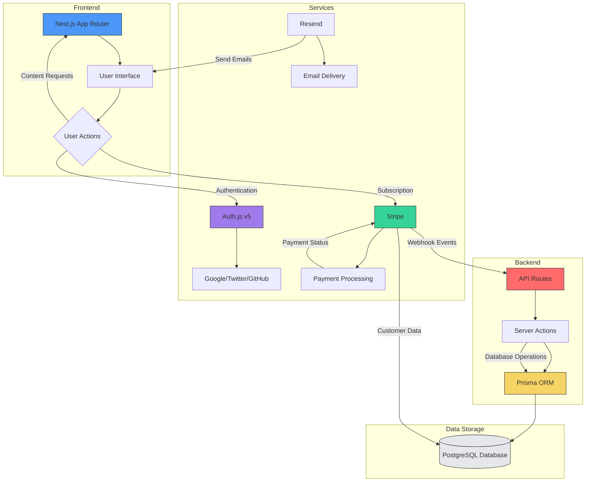

# System Overview

<cite>
**Referenced Files in This Document**   
- [README.md](file://README.md)
- [auth.config.ts](file://auth.config.ts)
- [prisma/schema.prisma](file://prisma/schema.prisma)
- [lib/stripe.ts](file://lib/stripe.ts)
- [lib/db.ts](file://lib/db.ts)
- [app/api/webhooks/stripe/route.ts](file://app/api/webhooks/stripe/route.ts)
- [app/layout.tsx](file://app/layout.tsx)
</cite>

## Table of Contents
1. [Introduction](#introduction)
2. [Core Architecture Components](#core-architecture-components)
3. [System Context and Data Flow](#system-context-and-data-flow)
4. [Key Features and User Experience](#key-features-and-user-experience)
5. [Deployment and Production Readiness](#deployment-and-production-readiness)
6. [Target Audience and Use Cases](#target-audience-and-use-cases)

## Introduction

The next-saas-stripe-starter-main project is a full-stack SaaS starter template built on modern web technologies, designed to accelerate the development of subscription-based applications. This production-ready foundation integrates authentication, role-based access control, and Stripe subscription management within a scalable architecture. The system enables developers to quickly bootstrap secure, feature-rich SaaS products with minimal configuration overhead. As a comprehensive starter kit, it combines cutting-edge frameworks and services to provide a robust development experience from day one.

**Section sources**
- [README.md](file://README.md#L1-L128)

## Core Architecture Components

The architecture is built around several key technologies that work together seamlessly. At its core, the application uses Next.js 14 with the App Router for server-side rendering and routing, providing optimal performance and developer experience. Authentication is handled by Auth.js (NextAuth) v5, supporting multiple providers including Google and email verification through Resend. The data layer utilizes Prisma ORM with PostgreSQL (Neon) for type-safe database interactions, while Stripe manages all subscription billing operations.

The frontend leverages Shadcn/ui components built on Radix UI and Tailwind CSS, enabling rapid UI development with accessible, customizable components. Server Actions are used extensively for data mutations, replacing traditional API routes for improved security and simplicity. The system also incorporates Contentlayer2 for MDX-based content management, allowing for type-safe documentation and blog content.

**Section sources**
- [README.md](file://README.md#L1-L128)
- [auth.config.ts](file://auth.config.ts#L1-L20)
- [prisma/schema.prisma](file://prisma/schema.prisma#L1-L80)
- [lib/stripe.ts](file://lib/stripe.ts#L1-L8)
- [lib/db.ts](file://lib/db.ts#L1-L17)

## System Context and Data Flow

**Diagram sources**
- [app/layout.tsx](file://app/layout.tsx#L1-L48)
- [app/api/webhooks/stripe/route.ts](file://app/api/webhooks/stripe/route.ts#L1-L77)
- [lib/stripe.ts](file://lib/stripe.ts#L1-L8)
- [lib/db.ts](file://lib/db.ts#L1-L17)

## Key Features and User Experience

The template provides a comprehensive set of features organized into distinct user experiences. Marketing pages serve as the public face of the application, featuring a landing page, blog, and pricing information. The documentation portal offers structured guides and reference materials, while authenticated users gain access to both a user dashboard and an admin dashboard with elevated privileges.

The user dashboard includes billing management, settings, and data visualization components, while the admin dashboard provides order management and system oversight capabilities. Role-based access control distinguishes between USER and ADMIN roles, ensuring appropriate permissions across the application. The system also includes specialized components for subscription management, including customer portal integration and plan upgrades/downgrades.

**Section sources**
- [README.md](file://README.md#L1-L128)
- [prisma/schema.prisma](file://prisma/schema.prisma#L1-L80)
- [app/api/webhooks/stripe/route.ts](file://app/api/webhooks/stripe/route.ts#L1-L77)

## Deployment and Production Readiness

The application is optimized for deployment on Vercel, with seamless integration for preview and production environments. The architecture follows best practices for production readiness, including environment variable validation, webhook signature verification, and secure credential management. Database operations are optimized through connection pooling and proper indexing, while the Prisma schema includes appropriate constraints and relationships.

The deployment process is streamlined through automated builds and deployments triggered by Git commits. The system includes comprehensive error handling, logging, and monitoring capabilities, with Vercel Analytics providing insights into user behavior. The template also includes a detailed environment setup guide, ensuring smooth configuration of third-party services like Stripe, Resend, and Neon PostgreSQL.

**Section sources**
- [README.md](file://README.md#L1-L128)
- [ENVIRONMENT_SETUP_GUIDE.md](file://ENVIRONMENT_SETUP_GUIDE.md#L115-L177)
- [QODER_AGENT_RULES.md](file://QODER_AGENT_RULES.md#L0-L769)

## Target Audience and Use Cases

This starter template is designed for developers building SaaS products who need a robust foundation with essential features pre-integrated. The primary use cases include rapid prototyping of subscription-based applications, secure user management with role-based access control, and reliable subscription billing through Stripe. The architecture supports various business models, from freemium services to enterprise-tier offerings with multiple pricing plans.

Developers benefit from the type-safe environment provided by TypeScript, Zod validation, and Prisma's type generation, reducing runtime errors and improving code quality. The component-based architecture with Shadcn/ui enables consistent UI development, while the separation of concerns between server and client components ensures optimal performance and security. This makes the template suitable for both solo developers and teams working on complex SaaS applications.

**Section sources**
- [README.md](file://README.md#L1-L128)
- [QODER_AGENT_RULES.md](file://QODER_AGENT_RULES.md#L0-L769)
- [prisma/schema.prisma](file://prisma/schema.prisma#L1-L80)