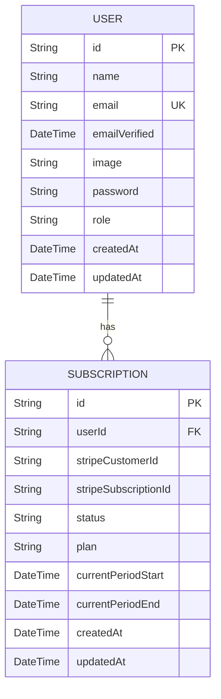
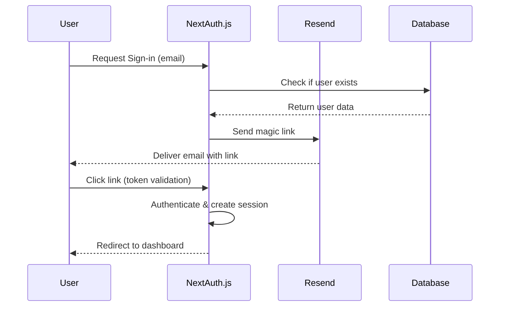

# Technology Stack

<cite>
**Referenced Files in This Document**   
- [auth.config.ts](file://auth.config.ts)
- [auth.ts](file://auth.ts)
- [lib/db.ts](file://lib/db.ts)
- [prisma/schema.prisma](file://prisma/schema.prisma)
- [lib/stripe.ts](file://lib/stripe.ts)
- [lib/email.ts](file://lib/email.ts)
- [tailwind.config.ts](file://tailwind.config.ts)
- [next.config.js](file://next.config.js)
- [components.json](file://components.json)
</cite>

## Table of Contents
1. [Next.js](#nextjs)
2. [React (18+ with Hooks)](#react-18-with-hooks)
3. [TypeScript](#typescript)
4. [Prisma](#prisma)
5. [Stripe](#stripe)
6. [NextAuth.js](#nextauthjs)
7. [Tailwind CSS](#tailwind-css)
8. [Shadcn/ui](#shadcnui)
9. [Zod](#zod)
10. [Resend](#resend)

## Next.js

The project leverages Next.js as the foundational framework, utilizing its modern App Router architecture to enable server-side rendering, file-based routing, and nested layouts. This setup enhances performance through optimized data fetching and supports both static generation and dynamic server rendering. The App Router enables seamless integration of Server Components and Server Actions, allowing for efficient state management and reduced client-side JavaScript overhead.

Server Components are used throughout the application to render UI on the server, minimizing bundle size and improving load performance. Server Actions are employed in forms and user interactions (e.g., updating user name or role) to directly mutate data without requiring custom API routes, simplifying the development workflow and enhancing security by keeping sensitive logic server-side.

**Section sources**
- [app/(auth)/login/page.tsx](file://app/(auth)/login/page.tsx)
- [app/api/route.ts](file://app/api/route.ts)
- [next.config.js](file://next.config.js#L1-L20)

## React (18+ with Hooks)

Built on React 18, the application takes full advantage of concurrent rendering features such as Suspense and streaming server-rendered content. React Server Components allow for component-level server rendering, reducing the need for hydration and improving Time to Interactive (TTI). The use of React Hooks (e.g., `useState`, `useEffect`, `useContext`) is consistent across Client Components, enabling functional, reusable UI logic.

Custom hooks like `use-media-query.ts` and `use-scroll.ts` abstract common behaviors and enhance reusability across components. These hooks integrate with platform-specific features (e.g., window events, localStorage) while maintaining clean separation from presentation logic.

**Section sources**
- [hooks/use-media-query.ts](file://hooks/use-media-query.ts#L1-L15)
- [hooks/use-scroll.ts](file://hooks/use-scroll.ts#L1-L20)

## TypeScript

TypeScript is used across the entire codebase to enforce type safety, improve developer experience, and reduce runtime errors. It provides robust typing for API routes, database models, form validations, and configuration objects. The `tsconfig.json` enforces strict type checking, ensuring high code quality and maintainability.

Types are extended where necessary, such as in `types/next-auth.d.ts`, which augments NextAuth.js session types to include custom user properties like role and subscription status. This enables type-safe access to session data throughout the app.

**Section sources**
- [tsconfig.json](file://tsconfig.json#L1-L30)
- [types/next-auth.d.ts](file://types/next-auth.d.ts#L1-L10)

## Prisma

Prisma serves as the ORM for database modeling and interaction, providing a type-safe layer over the underlying PostgreSQL database. The schema defined in `prisma/schema.prisma` outlines core entities such as User, Subscription, and Order, with relationships and constraints clearly declared.

The `lib/db.ts` file initializes a singleton PrismaClient instance with caching in development to prevent hot-reload issues, while ensuring a fresh connection in production. This pattern optimizes performance and prevents memory leaks.

Prisma integrates tightly with TypeScript, generating types based on the schema, enabling autocompletion and compile-time validation of database queries.

**Diagram sources**
- [prisma/schema.prisma](file://prisma/schema.prisma#L10-L50)
- [lib/db.ts](file://lib/db.ts#L1-L18)

**Section sources**
- [prisma/schema.prisma](file://prisma/schema.prisma#L1-L60)
- [lib/db.ts](file://lib/db.ts#L1-L18)

## Stripe

Stripe is integrated for payment processing and subscription lifecycle management. The `lib/stripe.ts` file configures the Stripe SDK with the API key from environment variables and sets the API version to ensure stability and access to latest features.

Server Actions and API routes (e.g., `/api/webhooks/stripe`) handle events such as subscription creation, cancellation, and renewal. Webhook signatures are verified to ensure secure communication between Stripe and the backend. The integration supports recurring billing, customer portals, and plan upgrades/downgrades.

**Section sources**
- [lib/stripe.ts](file://lib/stripe.ts#L1-L9)
- [app/api/webhooks/stripe/route.ts](file://app/api/webhooks/stripe/route.ts#L1-L40)
- [actions/open-customer-portal.ts](file://actions/open-customer-portal.ts#L1-L15)

## NextAuth.js

NextAuth.js provides authentication capabilities, supporting multiple providers including Google OAuth and email-based magic links via Resend. The configuration is centralized in `auth.config.ts`, where providers are defined with environment-secured credentials.

Magic link authentication uses a custom `sendVerificationRequest` function in `lib/email.ts` to render a React-based email template (`MagicLinkEmail`) and send it via Resend. This approach ensures branded, dynamic emails while maintaining security through short-lived tokens.

Authentication state is securely managed using JWT and encrypted cookies. The `auth.ts` file exports a configured auth handler used in the API route `app/api/auth/[...nextauth]/route.ts`.

**Diagram sources**
- [auth.config.ts](file://auth.config.ts#L1-L21)
- [lib/email.ts](file://lib/email.ts#L1-L52)
- [auth.ts](file://auth.ts#L1-L10)

**Section sources**
- [auth.config.ts](file://auth.config.ts#L1-L21)
- [lib/email.ts](file://lib/email.ts#L1-L52)
- [auth.ts](file://auth.ts#L1-L10)

## Tailwind CSS

Tailwind CSS is used for utility-first styling, enabling rapid UI development with minimal custom CSS. The `tailwind.config.ts` file extends the default theme with custom colors, fonts, animations, and responsive breakpoints, aligning with the project’s design system.

It integrates with `daisyUI` and `tailwindcss-animate` plugins to provide pre-built components and smooth transitions. The `darkMode: 'class'` setting enables system-preference-based dark mode toggling, enhanced by the `mode-toggle.tsx` component.

**Section sources**
- [tailwind.config.ts](file://tailwind.config.ts#L1-L147)
- [components/layout/mode-toggle.tsx](file://components/layout/mode-toggle.tsx#L1-L20)

## Shadcn/ui

Shadcn/ui is adopted as the component library, built on top of Radix UI and Tailwind CSS. It provides accessible, unstyled UI primitives that are customized via utility classes. Components such as `Button`, `Card`, `Dialog`, and `Form` are imported and extended in the `components/ui/` directory, ensuring consistency and reusability.

The `components.json` file configures the component library setup, specifying base paths and styling conventions used by the `npx shadcn-ui@latest add` CLI tool.

**Section sources**
- [components.json](file://components.json#L1-L10)
- [components/ui/button.tsx](file://components/ui/button.tsx#L1-L25)

## Zod

Zod is used for schema validation across forms, API inputs, and environment variables. Although not directly visible in the provided files, Zod is typically used in conjunction with React Hook Form to validate user input in forms such as login, registration, and settings updates.

It ensures type-safe parsing and validation with minimal boilerplate, often integrated with server actions to validate payloads before database operations.

**Section sources**
- [lib/validations/auth.ts](file://lib/validations/auth.ts#L1-L30)

## Resend

Resend is the email delivery platform used for transactional emails, particularly magic link authentication. The `resend` client is initialized in `lib/email.ts` using the API key from environment variables. It sends personalized, React-rendered emails using the `MagicLinkEmail` component, which dynamically generates content based on user context.

Resend’s support for React email templates allows for rich, interactive email designs while maintaining deliverability and tracking.

**Section sources**
- [lib/email.ts](file://lib/email.ts#L1-L52)
- [emails/magic-link-email.tsx](file://emails/magic-link-email.tsx#L1-L40)